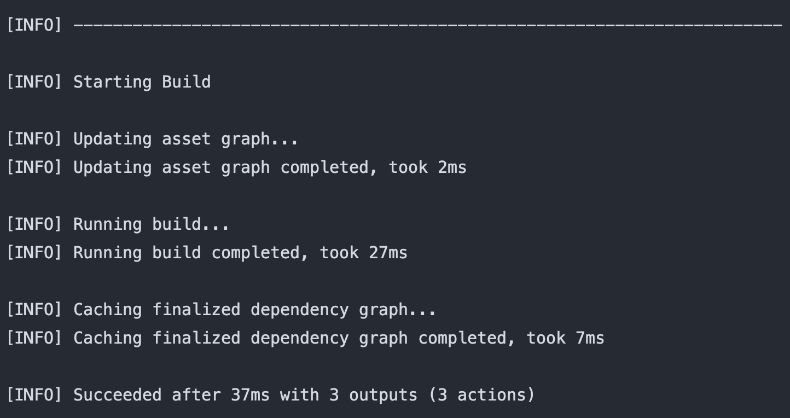

# Yet another localization approach in Flutter


I recently came across the task of localization for Flutter application and was surprised by the variety of approaches, while none of them combined all the features I was looking for.

My requirements for the approach were:
* translations are stored in separate files, one file per each language (format didn’t really matter, smth commonly used like `json`), located anywhere in the project;


* translation keys are generated to Dart code, no manual keys declaration, and no guessing whether such key exists;

* support constant watching for file system changes, rather than using the one-time generating command;

* the less code the better.

Pub package **[i69n](https://pub.dev/packages/i69n)** with some bridging code did the trick for me!


#### Why [i69n](https://pub.dev/packages/i69n)?

* It works with translations in `.yaml` files. Files can be put in any location under the lib folder, have to be named `<file_name>.i69n.yaml`, `<file_name>_fr.i69n.yaml`, `<file_name>_uk.i69n.yaml` etc.

* It generates `String` getters for translations keys into `.dart` files in the same folder the `.yaml` files are located.
  
What you put in `translations.i69n.yaml`:

```yaml
greetings: Hello, world!
```

What gets generated in `translations.i69n.dart`:

```dart
class Translations implements i69n.I69nMessageBundle {
  const Translations();

  String get greetings => "Hello, world!";
}
```

* It supports watching file system changes with standard `build_runner` command.

```shell
flutter packages pub run build_runner watch --delete-conflicting-outputs
```

* Coupling the results of its code generation with Flutter’s localization mechanism is done in a single file (dart code later in this article).

###### Bonus [i69n](https://pub.dev/packages/i69n) features:

* It generates methods instead of just `String` getters if the string is intended to be used as a format.

What you put in `translations.i69n.yaml`:

```yaml
passwordLengthValidationError(int length): 
  "The password should be at least $length characters long"
```

What gets generated in `translations.i69n.dart`:

```dart
class Translations implements i69n.I69nMessageBundle {  
  const Translations();
  
  String passwordLengthValidationError(int length) =>
    "The password should be at least $length characters long";
}
```

* Pluralization support.

What you put in `translations.i69n.yaml`:

```yaml
homePageCenterText(int times):  
"You have pushed the button $times ${_plural(times, one:'time', many:'times')}"
```

What gets generated in `translations.i69n.dart`:

```dart
String get _languageCode => 'en';

String _plural(int count,
        {String? zero,
        String? one,
        String? two,
        String? few,
        String? many,
        String? other}) =>
    i69n.plural(count, _languageCode,
        zero: zero, one: one, two: two, few: few, many: many, other: other);

class Translations implements i69n.I69nMessageBundle {
  const Translations();
  
  String homePageCenterText(int times) =>
    "You have pushed the button $times ${_plural(times, one: 'time', many: 'times')}";
}
```

* Dynamic access to translation values by using `String` keys.

What you put in `translations.i69n.yaml`:

```yaml
greetings: Hello, world!
```

What *else* gets generated in `translations.i69n.dart`:

```dart
class Translations implements i69n.I69nMessageBundle {
  const Translations();
  
  String get greetings => "Hello, world!";
  
  Object operator [](String key) {
    switch (key) {
      case 'greetings':
        return greetings;
      default:
        throw Exception('Message $key doesn\'t exist in $this');
  }
}
```

* Translation classes nesting.

What you put in `translations.i69n.yaml`:

```yaml
general:
  greetings: Hello, world!
    
validationErrors:
  passwordLengthValidationError(int length): 
    "The password should be at least $length characters long"
```

What gets generated in `translations.i69n.dart`:

```dart
class Translations implements i69n.I69nMessageBundle {
  const Translations();
  
  GeneralTranslations get general => 
    GeneralTranslations(this);
  
  ValidationErrorsTranslations get validationErrors =>
    ValidationErrorsTranslations(this);
}

class GeneralTranslations implements i69n.I69nMessageBundle {
  final Translations _parent;
  
  const GeneralTranslations(this._parent);
  
  String get greetings => "Hello, world!";
}

class ValidationErrorsTranslations implements i69n.I69nMessageBundle {
  final Translations _parent;
  
  const ValidationErrorsTranslations(this._parent);
  
  String passwordLengthValidationError(int length) =>
      "The password should be at least $length characters long";
}
```

* Translation classes inheritance from default language class.

What you put in `translations.i69n.yaml`:

```yaml
greetings: Hello, world!
```

What you put in `translations_fr.i69n.yaml`:

```yaml
greetings: Bonjour le monde!
```

What you put in `translations_uk.i69n.yaml`:

```yaml
greetings: Привіт, світе!
```

What gets generated in `translations.i69n.dart`:

```dart
class Translations implements i69n.I69nMessageBundle {
  const Translations();
  
  String get greetings => "Hello, world!";
}
```

What gets generated in `translations_fr.i69n.dart`:

```dart
class Translations_fr extends Translations {
  const Translations_fr();
  
  String get greetings => "Bonjour le monde!";
}
```

What gets generated in `translations_uk.i69n.dart`:

```dart
class Translations_uk extends Translations {
  const Translations_uk();
  
  String get greetings => "Привіт, світе!";
}
```

More features can be found in [documentation](https://pub.dev/packages/i69n).

##### Limitations:

* no automatic language detection, it is your responsibility to decide which translation to use;

* English has to be the default language.


#### How?

So how to implement Flutter app localization with [i69n](https://pub.dev/packages/i69n)?

I’ll use the default Flutter counter app as an example. You can follow a step-by-step tutorial here or jump into a complete project sample on [GitHub](https://github.com/foxanna/flutter_localization_example).

1. Create an empty Flutter project with `flutter create` command.


2. Edit `pubspec.yaml`.

```yaml
dependencies:
  flutter:
    sdk: flutter
  flutter_localizations:
    sdk: flutter

  i69n: ^2.0.1

dev_dependencies:
  flutter_test:
    sdk: flutter

  build_runner:
```

3. Run `flutter pub get` to get new dependencies.


4. Run the `build_runner` command to watch file system changes.

```shell
flutter packages pub run build_runner watch --delete-conflicting-outputs
```

5. Add a `.yaml` file for each language.

`translations.i69n.yaml`:

```yaml
homePageTitle: Flutter localization example
homePageCenterText(int times): 
  "You have pushed the button $times ${_plural(times, one:'time', many:'times')}"
incrementTooltip: Increment
```

`translations_fr.i69n.yaml`:

```yaml
homePageTitle: Exemple de localisation en Flutter
homePageCenterText(int times): "Vous avez appuyé le bouton $times fois"
incrementTooltip: Incrémenter
```

`translations_uk.i69n.dart`:

```yaml
homePageTitle: Приклад локалізації на Flutter
homePageCenterText(int times): 
  "Ви натиснули на кнопку $times ${_plural(times, one:'раз', few:'рази', many:'разів')}"
incrementTooltip: Додати
```

6. Make sure the corresponding `.dart` files were generated.



7. Now it’s time to bind generated translation files to Flutter’s localization mechanism. Here I create an `ExampleLocalizations` class that provides `delegate` and `supportedLocales` static fields. It lazily creates instances of `Translations` when `load` is called with new `locale`.

```dart
const _supportedLocales = ['en', 'fr', 'uk'];

class ExampleLocalizations {
  const ExampleLocalizations(this.translations);

  final Translations translations;

  static final _translations = <String, Translations Function()>{
    'en': () => const Translations(),
    'fr': () => const Translations_fr(),
    'uk': () => const Translations_uk(),
  };

  static const LocalizationsDelegate<ExampleLocalizations> delegate =
      _ExampleLocalizationsDelegate();

  static final List<Locale> supportedLocales =
      _supportedLocales.map((x) => Locale(x)).toList();

  static Future<ExampleLocalizations> load(Locale locale) =>
      Future.value(ExampleLocalizations(_translations[locale.languageCode]!()));

  static Translations of(BuildContext context) =>
      Localizations.of<ExampleLocalizations>(context, ExampleLocalizations)!
          .translations;
}

class _ExampleLocalizationsDelegate
    extends LocalizationsDelegate<ExampleLocalizations> {
  const _ExampleLocalizationsDelegate();

  @override
  bool isSupported(Locale locale) =>
      _supportedLocales.contains(locale.languageCode);

  @override
  Future<ExampleLocalizations> load(Locale locale) =>
      ExampleLocalizations.load(locale);

  @override
  bool shouldReload(LocalizationsDelegate<ExampleLocalizations> old) => false;
}
```

8. Register `ExampleLocalizations.delegate` in `MaterialApp`.

```dart
class MyApp extends StatelessWidget {
  const MyApp({Key? key}) : super(key: key);

  @override
  Widget build(BuildContext context) => MaterialApp(
      localizationsDelegates: [
        ExampleLocalizations.delegate,
        GlobalMaterialLocalizations.delegate,
        GlobalWidgetsLocalizations.delegate,
      ],
      supportedLocales: ExampleLocalizations.supportedLocales,
      home: const MyHomePage(),
    );
}
```

9. Now we can use localized messages inside `HomePage`.

```dart
class MyHomePage extends StatefulWidget {
  const MyHomePage({Key? key}) : super(key: key);

  @override
  _MyHomePageState createState() => _MyHomePageState();
}

class _MyHomePageState extends State<MyHomePage> {
  int _counter = 0;

  void _incrementCounter() => setState(() => _counter++);

  @override
  Widget build(BuildContext context) {
    final translations = ExampleLocalizations.of(context);

    return Scaffold(
      appBar: AppBar(
        title: Text(translations.homePageTitle),
      ),
      body: Center(
        child: Text(translations.homePageCenterText(_counter)),
      ),
      floatingActionButton: FloatingActionButton(
        onPressed: _incrementCounter,
        tooltip: translations.incrementTooltip,
        child: Icon(Icons.add),
      ),
    );
  }
}
```

It’s up to you how to get your translations around. 

In this example `ExampleLocalizations.of(context)` returns a `Translations` instance right away rather than `ExampleLocalizations`, just like `Theme.of(context)` returns `ThemeData`. 

You can choose to create a `context.translations()` extension, inject them into `Provider`, or put them somewhere you can access without having to provide `BuildContext` instance.

10. To localize iOS application you also have to add `CFBundleLocalizations` key in `Info.plist`.

```xml
<?xml version="1.0" encoding="UTF-8"?>
<!DOCTYPE plist PUBLIC "-//Apple//DTD PLIST 1.0//EN" "http://www.apple.com/DTDs/PropertyList-1.0.dtd">
<plist version="1.0">
<dict>
   <key>CFBundleLocalizations</key>
   <array>
      <string>en</string>
      <string>fr</string>
      <string>uk</string>
   </array>
</dict>
</plist>
```

Finally, you can run the app! When the device language settings change, it will be translated into French or Ukrainian or will default to English for other languages.


You can find the full code for this project on  [GitHub](https://github.com/foxanna/flutter_localization_example).

That’s it! Thanks for reading till the end.


--------
*[Originally published](https://medium.com/flutter-community/yet-another-localization-approach-in-flutter-477cf058ba41) on May 2020 under "Flutter community" Medium publication.*
