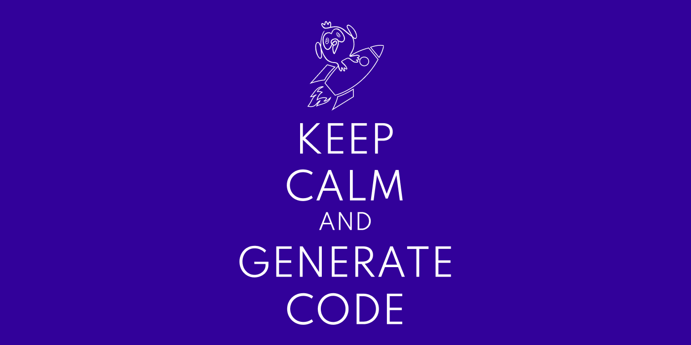

# Code less, deliver more

*Online talk at [the Flutteristas conference 2021](https://www.youtube.com/playlist?list=PL4dBIh1xps-EU8-3BfrOMAAy2R8VzxEGY).*

*Watch on [YouTube](https://youtu.be/tcixn1Y1Y-Q).*

Lots of everyday programmer tasks consist of creating boilerplate code. It’s not only boring, time-consuming, and error-prone, but it also requires efforts to maintain it later. With code generation, you can create only the essential code and leave all the routine to the computer.

We’ll see how code generation works in Flutter and what typical tasks it can facilitate in mobile apps development.

*The source code and slides are available in [flutteristas_conf_2021 GitHub repository](https://github.com/foxanna/flutteristas_conf_2021).*