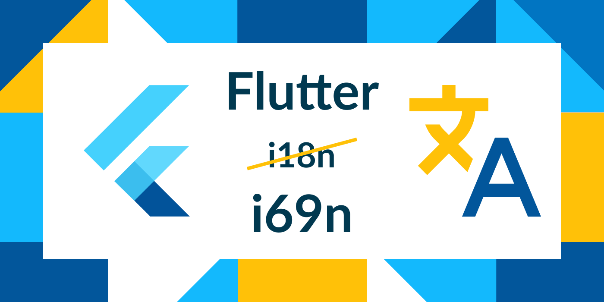

# Ще один підхід до локалізації Flutter-додатків, якого вам бракувало



## То в чому проблема? 

Задача локалізації Flutter-додатків вже має багато варіантів реалізації:

🔸 [Офіційний гайд](https://flutter.dev/docs/development/accessibility-and-localization/internationalization) пропонує надавати переклади у `*.arb` файлах:

```json
{
   "helloWorld": "Hello World!",
   "@helloWorld": {
     "description": "The conventional newborn programmer greeting"
   }
}
```

та генерувати з них Dart класи з однойменними полями для доступу до локалізованих рядків в момент компіляції за допомогою флагу:

```yaml
flutter:
 generate: true
```

у `pubspec.yaml` файлі. У результаті, доступ до локалізованого рядку виглядає наступним чином:

```dart
final localizedString = AppLocalizations.of(context)!.helloWorld;
```

🔸 Команда з [Localizely](https://localizely.com/) створила [Flutter Intl плагін](https://plugins.jetbrains.com/plugin/13666-flutter-intl) для Android Studio та Visual Studio Code, який перегенерує вміст аналогу `AppLocalizations` з попереднього пункту щоразу, як у проєкті з’являється ще одна мова або ж новий текст для перекладу. Доступ до локалізованого рядку скорочується до:

```dart
final localizedString = S.of(context).helloWorld;
```

Або ж:

```dart
final localizedString = S.current.helloWorld;
```

якщо немає доступу до контексту.

Докладніше про цей підхід у [туторіалі від команди Ray Wenderlich](https://www.raywenderlich.com/10794904-internationalizing-and-localizing-your-flutter-app).

🔸 Популярний пакет [easy_localization](https://pub.dev/packages/easy_localization) дозволяє зберігати переклади у багатьох форматах: `json`, `csv`, `yaml`, `xml` і надає глобальну функцію або екстеншен `tr()` для доступу до локалізованого рядка за `String` ключем:

```dart
final localizedString = tr('helloWorld');
final localizedString = 'helloWorld'.tr();
```

🔸 Аналогічний підхід можна реалізувати й [власноруч](https://resocoder.com/2019/06/01/flutter-localization-the-easy-way-internationalization-with-json/). У момент зміни налаштувань мови потрібно завантажити відповідний `json` файл у `Map<String, String> _localizedStrings` та отримати доступ до локалізованих рядків за допомогою функції, що приймає `String` ключ:

```dart
String translate(String key) => _localizedStrings[key];
```

🔸 Та що там, переклади навіть [пропонують поставляти у мапі](https://pub.dev/packages/get#internationalization) прямо в Dart коді:

```dart
class Translations {
  Map<String, Map<String, String>> get keys => {
    'en_US': {
      'hello': 'Hello World',
    },
  };
}
```

Проте жоден з цих варіантів --не позбавлений фатального недоліку-- не задовільняє **всі** мої вимоги до імплементації локалізації, а саме:

* переклади мають зберігатися у окремих файлах будь-де у проєкті, по одному на кожну підтримувану мову (формат файлів не є принциповим, підійде щось поширене, накшталт `json`);

* ключі до рядків з перекладом мають генеруватися у Dart-класи з однойменними полями, що позбавляє від необхідності оголошувати ключі вручну або вгадувати, чи такий ключ взагалі існує;

* підтримка постійного трекінгу змін у файлах з перекладами з оновленням Dart-класів;

* що менше коду — то краще.

Отже, цілком очевидно, що світу бракує ще одного підходу до локалізації Flutter-додатків, який би відповідав усім цим критеріям, і яким я зараз тут і поділюся.


## Рішення

В основі цього підходу лежить пакет [**i69n**](https://pub.dev/packages/i69n).

### Чому саме [i69n](https://pub.dev/packages/i69n)?

🔹 Цей пакет працює з перекладами у `*.yaml` файлах, що можуть бути розташовані будь-де у `lib` діректорії. Достатньо, щоб назви файлів містили код мови і мали розширення `.i69n.yaml`, наприклад: `translations_fr.i69n.yaml`, `translations_uk.i69n.yaml`. Для мови за замовчуванням код у назві файлу не потрібен: `translations.i69n.yaml`.

🔹 Пакет використовує стандартний механізм генерації коду через `build_runner`. Після запуску команди генерації

```shell
flutter packages pub run build_runner build --delete-conflicting-outputs
```

біля `*.i69n.yaml` файлів з’являються `*.i69n.dart` файли з Dart-класами, що містять однойменні `String` геттери. Наприклад, файл `translations.i69n.yaml` містить:

```yaml
greetings: Hello, world!
```

Після генерації з’явиться файл `translations.i69n.dart`:

```dart
class Translations implements i69n.I69nMessageBundle {
  const Translations();

  String get greetings => "Hello, world!";
}
```

🔹 Використання `build_runner` з параметром `watch` робить можливим постійний трекінг змін у файлах з перекладами і перегенерацію Dart-класів після кожного апдейту.

```shell
flutter packages pub run build_runner watch --delete-conflicting-outputs
```

🔹 Щоб пов’язати згенеровані Dart-класи з механізмом локалізації у Flutter-додатку, достатньо створити один файл (код буде пізніше).

### Бонусні фішки [i69n](https://pub.dev/packages/i69n):

🔸 Dart класи міститимуть методи замість геттерів, якщо рядок використовується для форматування даних.

Наприклад, файл з перекладом `translations.i69n.yaml` містить:

```yaml
passwordLengthValidationError(int length): 
  "The password should be at least $length characters long"
```

Тоді згенерований файл `translations.i69n.dart` міститиме:

```dart
class Translations implements i69n.I69nMessageBundle {  
  const Translations();
  
  String passwordLengthValidationError(int length) =>
    "The password should be at least $length characters long";
}
```

🔸 Підтримка плюралізації.

Якщо файл з перекладом `translations.i69n.yaml` містить:

```yaml
homePageCenterText(int times):  
"You have pushed the button $times ${_plural(times, one:'time', many:'times')}"
```

то згенерований файл `translations.i69n.dart` міститиме:

```dart
String get _languageCode => 'en';

String _plural(int count,
        {String? zero,
        String? one,
        String? two,
        String? few,
        String? many,
        String? other}) =>
    i69n.plural(count, _languageCode,
        zero: zero, one: one, two: two, few: few, many: many, other: other);

class Translations implements i69n.I69nMessageBundle {
  const Translations();
  
  String homePageCenterText(int times) =>
    "You have pushed the button $times ${_plural(times, one: 'time', many: 'times')}";
}
```

🔸 Динамічнй доступ до переведеного тексту за `String` ключем.

Повернемося до першого прикладу `translations.i69n.yaml` файлу:

```yaml
greetings: Hello, world!
```

Згенерований файл `translations.i69n.dart` поміж іншим міститиме:

```dart
class Translations implements i69n.I69nMessageBundle {
  const Translations();
  
  String get greetings => "Hello, world!";
  
  Object operator [](String key) {
    switch (key) {
      case 'greetings':
        return greetings;
      default:
        throw Exception('Message $key doesn\'t exist in $this');
  }
}
```

🔸 Згенеровані Dart-класи повторюють структуру даних у `.yaml` файлах.

Оскільки YAML є мовою серіалізації даних, за його допомогою можна описати більш складні структури. Наприклад, тексти для помилок валідації можна об’єднати в групу `validationErrors`, а розповсюджені повідомлення — в групу `general`. Тоді згенерований клас `Translations` матиме два геттери: `validationErrors` з типом `ValidationErrorsTranslations` та `general` з типом `GeneralTranslations`.

Вміст файлу з перекладом `translations.i69n.yaml`:

```yaml
general:
  greetings: Hello, world!
    
validationErrors:
  passwordLengthValidationError(int length): 
    "The password should be at least $length characters long"
```

Вміст згенерованого файлу `translations.i69n.dart`:

```dart
class Translations implements i69n.I69nMessageBundle {
  const Translations();
  
  GeneralTranslations get general => 
    GeneralTranslations(this);
  
  ValidationErrorsTranslations get validationErrors =>
    ValidationErrorsTranslations(this);
}

class GeneralTranslations implements i69n.I69nMessageBundle {
  final Translations _parent;
  
  const GeneralTranslations(this._parent);
  
  String get greetings => "Hello, world!";
}

class ValidationErrorsTranslations implements i69n.I69nMessageBundle {
  final Translations _parent;
  
  const ValidationErrorsTranslations(this._parent);
  
  String passwordLengthValidationError(int length) =>
      "The password should be at least $length characters long";
}
```

🔸 Згенеровані класи з перекладами наслідують від класу для мови за замовчуванням.

Вміст `translations.i69n.yaml`:

```yaml
greetings: Hello, world!
```

Вміст `translations_fr.i69n.yaml`:

```yaml
greetings: Bonjour le monde!
```

Вміст `translations_uk.i69n.yaml`:

```yaml
greetings: Привіт, світе!
```

Згенерований файл `translations.i69n.dart` міститиме:

```dart
class Translations implements i69n.I69nMessageBundle {
  const Translations();
  
  String get greetings => "Hello, world!";
}
```

Згенерований файл `translations_fr.i69n.dart` міститиме:

```dart
class Translations_fr extends Translations {
  const Translations_fr();
  
  String get greetings => "Bonjour le monde!";
}
```

Згенерований файл `translations_uk.i69n.dart` міститиме:

```dart
class Translations_uk extends Translations {
  const Translations_uk();
  
  String get greetings => "Привіт, світе!";
}
```

🔸 Про інші можливості пакету можна дізнатися у [документації](https://pub.dev/packages/i69n).

#### Обмеження [i69n](https://pub.dev/packages/i69n):

* відсутнє автоматичне визначення поточної мови, реалізація такого механізму лежить на плечах розробників;

* англійська має бути мовою за замовчуванням.


## Та давай вже до коду!

Прямо зараз розглянемо, як виглядає повна імплементація локалізації Flutter-додатку з пакетом [i69n](https://pub.dev/packages/i69n).

Для прикладу я використаю код з шаблонного Flutter-проєкту. Можете слідкувати за покроковою інструкцією тут, або ж скачати фінальну версію з [GitHub](https://github.com/foxanna/flutter_localization_example).

1\. Створімо порожній Flutter проєкт за допомогою команди `flutter create`.

2\. Змінимо `pubspec.yaml`.

```yaml
dependencies:
  flutter:
    sdk: flutter
  flutter_localizations:
    sdk: flutter

  i69n: ^2.0.1

dev_dependencies:
  flutter_test:
    sdk: flutter

  build_runner:
```

3\. Виконаємо команду `flutter pub get`, щоб завантажити нові бібліотеки.

4\. Запустимо `build_runner`, щоб стежити за змінами у файлах проєкту.

```shell
flutter packages pub run build_runner watch --delete-conflicting-outputs
```

5\. Додамо `.yaml` файл для кожної мови додатку.

`translations.i69n.yaml`:

```yaml
homePageTitle: Flutter localization example
homePageCenterText(int times): 
  "You have pushed the button $times ${_plural(times, one:'time', many:'times')}"
incrementTooltip: Increment
```

`translations_fr.i69n.yaml`:

```yaml
homePageTitle: Exemple de localisation en Flutter
homePageCenterText(int times): "Vous avez appuyé le bouton $times fois"
incrementTooltip: Incrémenter
```

`translations_uk.i69n.dart`:

```yaml
homePageTitle: Приклад локалізації на Flutter
homePageCenterText(int times): 
  "Ви натиснули на кнопку $times ${_plural(times, one:'раз', few:'рази', many:'разів')}"
incrementTooltip: Додати
```

6\. Переконайтеся, що генерація завершилась успішно і відповідні `.dart` файли було згенеровано.


7\. Саме час пов’язати згенерований код з механізмом локалізації Flutter-додатків.

Створімо клас `ExampleLocalizations`, який надає статичні поля `delegate` та `supportedLocales`. Він ліниво проініціалізує екземпляри `Translations` або дочірніх класів, коли метод `load` буде викликано з новим значенням параметру `locale`.

```dart
const _supportedLocales = ['en', 'fr', 'uk'];

class ExampleLocalizations {
  const ExampleLocalizations(this.translations);

  final Translations translations;

  static final _translations = <String, Translations Function()>{
    'en': () => const Translations(),
    'fr': () => const Translations_fr(),
    'uk': () => const Translations_uk(),
  };

  static const LocalizationsDelegate<ExampleLocalizations> delegate =
      _ExampleLocalizationsDelegate();

  static final List<Locale> supportedLocales =
      _supportedLocales.map((x) => Locale(x)).toList();

  static Future<ExampleLocalizations> load(Locale locale) =>
      Future.value(ExampleLocalizations(_translations[locale.languageCode]!()));

  static Translations of(BuildContext context) =>
      Localizations.of<ExampleLocalizations>(context, ExampleLocalizations)!
          .translations;
}

class _ExampleLocalizationsDelegate
    extends LocalizationsDelegate<ExampleLocalizations> {
  const _ExampleLocalizationsDelegate();

  @override
  bool isSupported(Locale locale) =>
      _supportedLocales.contains(locale.languageCode);

  @override
  Future<ExampleLocalizations> load(Locale locale) =>
      ExampleLocalizations.load(locale);

  @override
  bool shouldReload(LocalizationsDelegate<ExampleLocalizations> old) => false;
}
```

8\. Зареєструємо `ExampleLocalizations.delegate` у `MaterialApp`.

```dart
class MyApp extends StatelessWidget {
  const MyApp({Key? key}) : super(key: key);

  @override
  Widget build(BuildContext context) => MaterialApp(
      localizationsDelegates: [
        ExampleLocalizations.delegate,
        GlobalMaterialLocalizations.delegate,
        GlobalWidgetsLocalizations.delegate,
      ],
      supportedLocales: ExampleLocalizations.supportedLocales,
      home: const MyHomePage(),
    );
}
```

9\. Тепер можемо використати локалізовані повідомлення у `HomePage`.

```dart
class MyHomePage extends StatefulWidget {
  const MyHomePage({Key? key}) : super(key: key);

  @override
  _MyHomePageState createState() => _MyHomePageState();
}

class _MyHomePageState extends State<MyHomePage> {
  int _counter = 0;

  void _incrementCounter() => setState(() => _counter++);

  @override
  Widget build(BuildContext context) {
    final translations = ExampleLocalizations.of(context);

    return Scaffold(
      appBar: AppBar(
        title: Text(translations.homePageTitle),
      ),
      body: Center(
        child: Text(translations.homePageCenterText(_counter)),
      ),
      floatingActionButton: FloatingActionButton(
        onPressed: _incrementCounter,
        tooltip: translations.incrementTooltip,
        child: Icon(Icons.add),
      ),
    );
  }
}
```

Як саме реалізувати доступ до локалізованих рядків, залежить від ваших вподобань.

У цьому прикладі `ExampleLocalizations.of(context)` повертає екземпляр саме типу `Translations`, а не `ExampleLocalizations` — аналогічно до того, як і `Theme.of(context)` повертає `ThemeData`.

Ви також можете створити екстеншен `context.translations()`, помістити відповідний об’єкт `Translations` у `Provider`, або взагалі зберігати його десь там, де не потрібен `BuildContext`.

10\. Для локалізації iOS-додатку ще доведеться додати `CFBundleLocalizations` масив у `Info.plist`.

```xml
<?xml version="1.0" encoding="UTF-8"?>
<!DOCTYPE plist PUBLIC "-//Apple//DTD PLIST 1.0//EN" "http://www.apple.com/DTDs/PropertyList-1.0.dtd">
<plist version="1.0">
<dict>
   <key>CFBundleLocalizations</key>
   <array>
      <string>en</string>
      <string>fr</string>
      <string>uk</string>
   </array>
</dict>
</plist>
```

Оце і все, можна запускати!

Коли мова у налаштуваннях смартфону буде змінена на французьку або українську, додаток буде використовувати відповідні переклади. Для інших мов додаток буде використовувати англійську.


*[Опубліковано](https://dou.ua/forums/topic/35112/) на DOU у жовтні 2021.*
