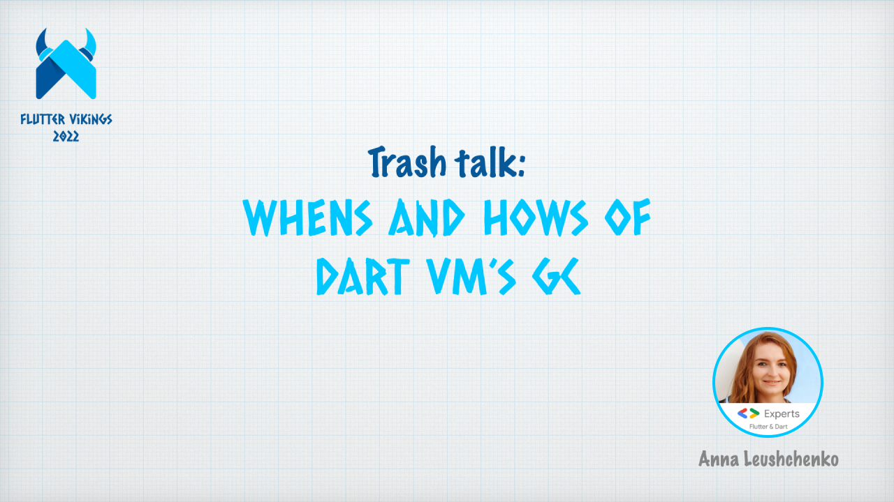

# Trash talk: WHENs and HOWs of Dart VM’s GC

*Online talk at [the Flutter Vikings conference](https://feb2022.fluttervikings.com/) on February 2, 2022.*

*Watch on [YouTube](https://youtu.be/qD_tLPC-hQQ).*

In the dark deeps of Dart VM, where trees are boughy, tracks are twisted, and the space is limited, there lives a bright hero, who always welcomes new visitors, helps them find their way and stay connected to the roots, respects their age; who cares about the environment and diligently collects and recycles the garbage, freeing up space for new visitors.

Garbage Collector rarely gets the love and attention it deserves. Even though every Flutter developer has it as their friend, only few know it close enough, what it is like, and how it behaves.

I am determined to fix this injustice by spreading the word about all the good things Dart VM’s Garbage Collector does: we’ll look at how Dart objects are allocated, managed, and moved around, and when and how they get collected.
