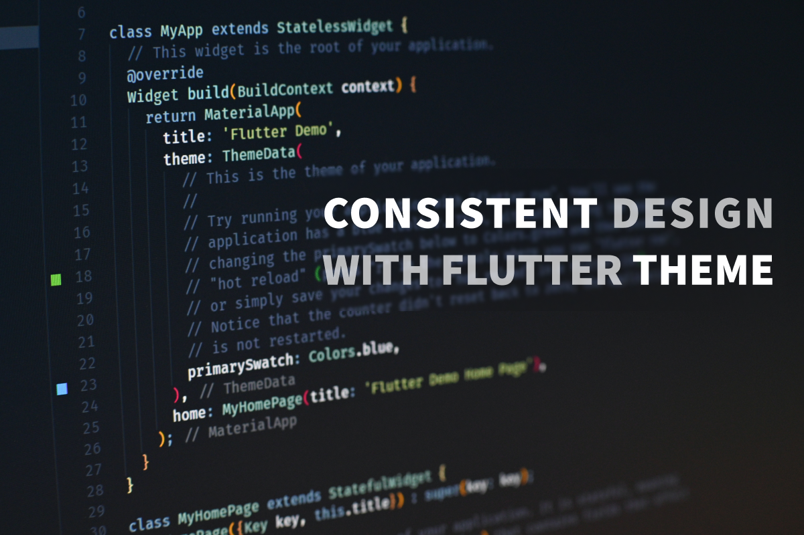
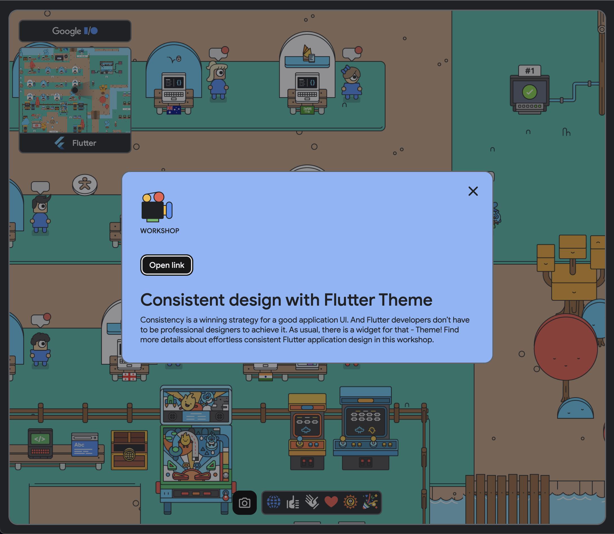

# Consistent design with Flutter Theme

*DartPaf workshop featured at [Google I/O 2022](https://io.google/2022/)*

*[Give it a try](https://dartpad.dev/workshops.html?webserver=https://raw.githubusercontent.com/foxanna/flutter_theme_workshop/main/workshop)*

Consistency is a winning strategy for a good application UI. And Flutter developers don’t have to be professional designers to achieve it. As usual, there is a widget for that - Theme! Find more details about effortless consistent Flutter application design in this workshop.

At Google I/O adventure
