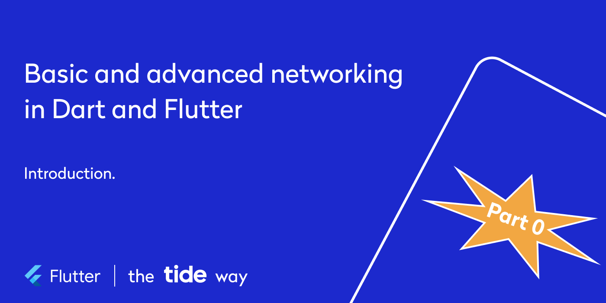
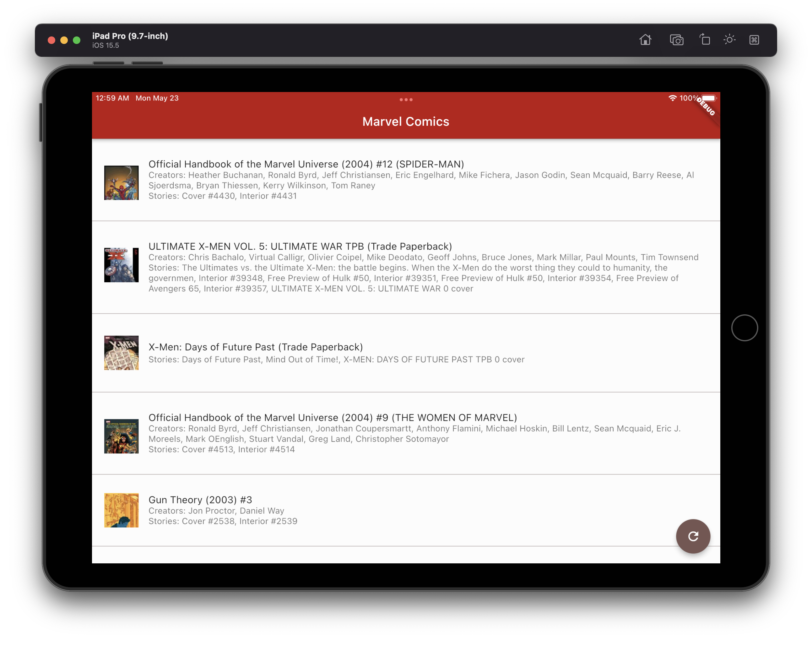
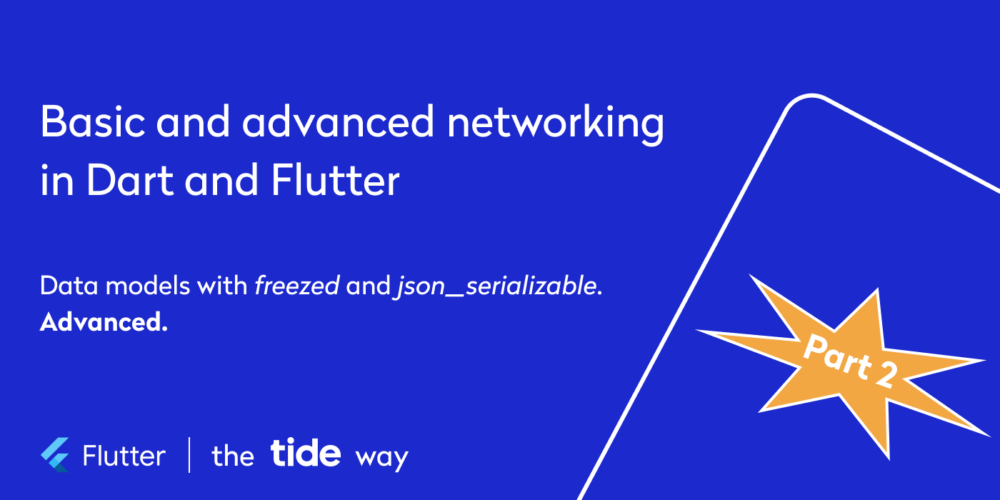
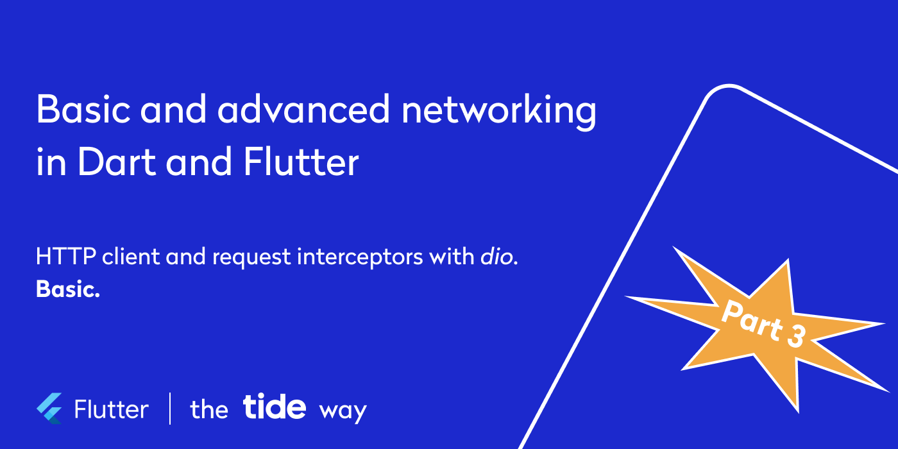
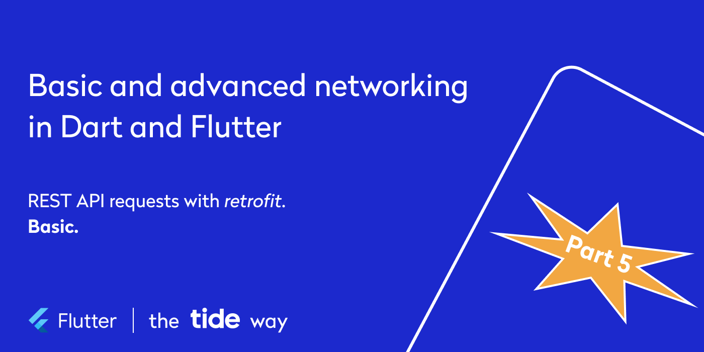
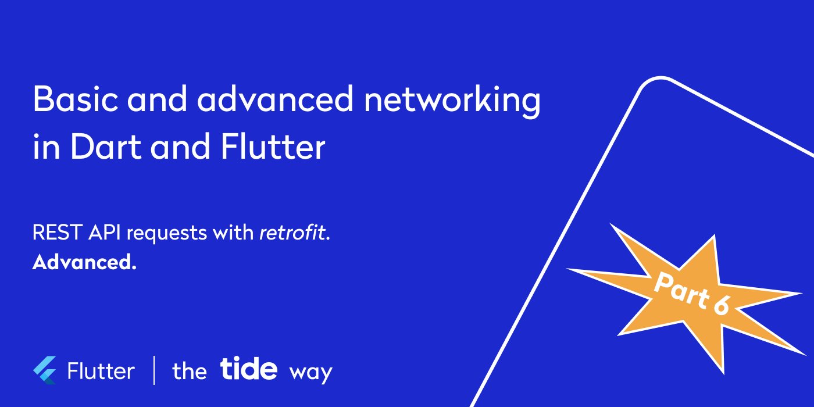

# Basic and advanced networking in Dart and Flutter — the Tide way

## Part 0: introduction



Most applications, be it mobile, web, or desktop, depend on some kind of backend. Thus, an API layer is an integral part of application implementation.

This six-part series presents tools and approaches that facilitate API layer implementation in Flutter and Dart applications we use at [**Tide**](https://www.tide.co/):

* [Part 1](#part-1-data-models-with-freezed-and-json_serializable-basic): data models with freezed and json_serializable. Basic.
* [Part 2](#part-2-data-models-with-freezed-and-json_serializable-advanced): data models with freezed and json_serializable. Advanced.
* [Part 3](#part-3-http-client-and-request-interceptors-with-dio-basic): HTTP client and request interceptors with dio. Basic.
* [Part 4](#part-4-http-client-and-request-interceptors-with-dio-advanced): HTTP client and request interceptors with dio. Advanced.
* [Part 5](#part-5-rest-api-requests-with-retrofit-basic): REST API requests with retrofit. Basic.
* [Part 6](#part-6-rest-api-requests-with-retrofit-advanced): REST API requests with retrofit. Advanced.

Each of these parts can be applied independently, but together they complement each other and form a full-fledged API layer implementation.

### TL;DR

<details>

To have some fun we’ll use [Marvel Comic API](https://developer.marvel.com/) and create a Flutter application that displays a list of Marvel comics.



Check out the [*Flutter Advanced Networking*](https://github.com/foxanna/flutter_advanced_networking) GitHub repository with a full example.

</details>

### New to build_runner?

<details>

We at [**Tide**](https://www.tide.co/) rely heavily on the code generating mechanism with [build_runner](https://pub.dev/packages/build_runner). If this command does not mean anything to you

```shell
flutter packages pub run build_runner build --delete-conflicting-outputs
 
```

[Gist](https://gist.github.com/foxanna/78e8739ceb47b331a610dc792e87fe0d#file-flutter_advanced_networking_build_runner_build-sh)

checkout the [“Code less, deliver more”](https://www.youtube.com/watch?v=GGwTfsPDiO0&t=511s) talk by
@foxanna at [The Flutteristas Conference](https://www.youtube.com/playlist?list=PL4dBIh1xps-EU8-3BfrOMAAy2R8VzxEGY).

</details>

### Pssst… We are hiring!

<details>

[**Tide**](https://www.tide.co/) is the leading provider of UK SME business accounts and one of the fastest-growing FinTechs in the UK. We are transforming the business banking market, providing a smart current account that gives time back to business owners.

At [**Tide**](https://www.tide.co/), we develop mobile applications for Android and iOS using Flutter. We have a team of over 30 mobile engineers. Yet we’re scaling at speed with a focus on hiring talented individuals with a growth mindset and ownership mentality. Check out our [careers page](https://www.tide.co/careers/) for “Mobile Engineer” positions in different locations.

</details>


## Part 1: data models with freezed and json_serializable. Basic.


Parts 1 and 2 of this series are dedicated to creating Dart classes containing fields to carry data obtained through API requests and logic to parse this data from and to JSON.

This part aims to create a basic implementation of a Dart class with the help of [_freezed_](https://pub.dev/packages/freezed) and [_json_serializable_](https://pub.dev/packages/json_serializable) packages.

[_freezed_](https://pub.dev/packages/freezed) is a code generating package that enriches plain Dart objects with overrides of `operator ==` and `hashCode`, `toString`, and useful `copyWith` methods. It also helps with unions and pattern-matching. [_json_serializable_](https://pub.dev/packages/json_serializable) is also a code generating package that generates `toJson` and `fromJson` methods for objects serialization. For motivation, installation instructions, and basic implementation details refer to the docs.

Additionally, attributes from helper [_freezed_annotation_](https://pub.dev/packages/freezed_annotation) and [_json_annotation_](https://pub.dev/packages/json_annotation) packages are used.

**In this part:**

1. plain data model
2. JSON serialization
3. JsonKey attribute
4. enums in JSON

For advanced topics check out [Part 2](#part-2-data-models-with-freezed-and-json_serializable-advanced). It talks about:

1. JSON converters
2. unions in JSON
3. generics in JSON

### 0. Prerequisites

<details>

When this series is released, the latest Flutter version is 3.0.

The latest versions of required dependencies in `pubspec.yaml` file are:

```yaml
...

dependencies:
  freezed_annotation: 2.0.3
  json_annotation: 4.5.0
  ...

dev_dependencies:
  build_runner: 2.1.11
  freezed: 2.0.3+1
  json_serializable: 6.2.0
  ...
 
```

[Gist](https://gist.github.com/foxanna/6c74dc63a870435f50fab0a1c53756d3#file-flutter_advanced_networking_part_1_2_pubspec-yaml)

Further code examples are built on top of the code with an empty Flutter project, which can be found under the [_part-0_](https://github.com/foxanna/flutter_advanced_networking/tree/part-0) tag in the [*Flutter Advanced Networking*](https://github.com/foxanna/flutter_advanced_networking) GitHub repository.

</details>

### 1. Plain data model

<details>

In order to receive some data from the backend, the first task is to create some data structures to contain this data. What would a plain Dart object look like?

```dart
// marvel_comic.dart

class MarvelComic {
  const MarvelComic({
    required this.id,
    this.digitalId,
    this.title,
    this.modified,
    this.format,
    required this.images,
  });

  final int id;
  final int? digitalId;
  final String? title;
  final DateTime? modified;
  final MarvelComicFormat? format;
  final List<String> images;
}
 
```

[Gist](https://gist.github.com/foxanna/d566913022299501707d4aac80522036#file-flutter_advanced_networking_p1_plain_dart_object-dart)

```dart
// marvel_comic_format.dart

enum MarvelComicFormat {
  comic,
  magazine,
  tradePaperback,
  hardCover,
  digest,
  graphicNovel,
  digitalComic,
  infiniteComic,
}
 
```

[Gist](https://gist.github.com/foxanna/31a68c98e24cad77022e5bd8be59863b#file-flutter_advanced_networking_p1_plain_enum-dart)

Looks good, but not enough. The default `toString` implementation will only print `Instance of ‘MarvelComic’`. Implicit `operator ==` only compares objects' references and not their content. The `images` list is modifiable. There is no implicit `copyWith` method, and a typical manual implementation would not allow updating nullable fields with `null` values:

```dart
// marvel_comic.dart

class MarvelComic {
  ...
    
  MarvelComic copyWith({
    int? id,
    int? digitalId,
    String? title,
    DateTime? modified,
    MarvelComicFormat? format,
    List<String>? images,
  }) =>
      MarvelComic(
        id: id ?? this.id,
        digitalId: digitalId ?? this.digitalId,
        title: title ?? this.title,
        modified: modified ?? this.modified,
        format: format ?? this.format,
        images: images ?? this.images,
      );
}

```

[Gist](https://gist.github.com/foxanna/2813d6c8739eb43b8e912df8b97f2fd7#file-flutter_advanced_networking_p1_manual_copywith-dart)

That’s why we at [**Tide**](https://www.tide.co/) use [_freezed_](https://pub.dev/packages/freezed) for every data class.

Here is the same `MarvelComic` class declaration with [_freezed_](https://pub.dev/packages/freezed) package:

```dart
// marvel_comic.dart

import 'package:freezed_annotation/freezed_annotation.dart';

part 'marvel_comic.freezed.dart';

@freezed
class MarvelComic with _$MarvelComic {
  const factory MarvelComic({
    required int id,
    int? digitalId,
    String? title,
    DateTime? modified,
    MarvelComicFormat? format,
    @Default(<String>[]) List<String> images,
  }) = _MarvelComic;
}
 
```

[Gist](https://gist.github.com/foxanna/773e1693f095c7d494c3a646f8936d22#file-flutter_advanced_networking_p1_simplest_freezed_data_model-dart)

The required pieces are `part` file declaration on line `5`, `@freezed` attribute on line `7`, class declaration on line `8`, factory constructor declaration on line `9`, and internal class declaration on line `16`. Lines `10–15` contain a list of fields that the generated class will contain. Positional arguments are also supported, but we at [**Tide**](https://www.tide.co/) prefer named parameters.

Non-nullable fields should either be `required` or contain the `@Default` value. We typically provide default values for lists, so there is no need to check if a list is `null`, when we are only interested in whether the list contains any data.

The generated file `.freezed.dart` is too big to be listed here in full, but here are its key parts.

A declaration of an inheritor of `MarvelComic` class on line `5`, which contains the same fields on lines `15–20`. A constructor uses the default value for `_images` field on line `12` and `13`, and `images` property on line `21` wraps inner `_images` list to an unmodifiable copy:

```dart
// marvel_comic.freezed.dart

part of 'marvel_comic.dart';

class _$_MarvelComic implements _MarvelComic {
  const _$_MarvelComic({
      required this.id,
      this.digitalId,
      this.title,
      this.modified,
      this.format,
      final List<String> images = const <String>[]
    }) : _images = images;

  final int id;
  final int? digitalId;
  final String? title;
  final DateTime? modified;
  final MarvelComicFormat? format;
  final List<String> _images;
  List<String> get images => EqualUnmodifiableListView(_images);

  ...
}

```

[Gist](https://gist.github.com/foxanna/915ce988c243c1de2691455b5cf03fc4#file-flutter_advanced_networking_p1_simplest_freezed_data_model_1-freezed-dart)

An override of the `toString` method in a human-readable way on line `9`:

```dart
// marvel_comic.freezed.dart

...

class _$_MarvelComic implements _MarvelComic {
  ...
  
  @override
  String toString() {
    return 'MarvelComic(id: $id, digitalId: $digitalId, title: $title, modified: $modified, format: $format, images: $images)';
  }
   
  ...
}
 
```

[Gist](https://gist.github.com/foxanna/5ed89f385e5c40eb81beb8d925084471#file-flutter_advanced_networking_p1_simplest_freezed_data_model_2-freezed-dart)

Overrides of `operator == on` line `9` and `hashCode` on line `22` that depend on fields values, performing a deep comparison of models and lists:

```dart
// marvel_comic.freezed.dart

...
  
class _$_MarvelComic implements _MarvelComic {
  ...
  
  @override
  bool operator ==(dynamic other) {
    return identical(this, other) ||
        (other.runtimeType == runtimeType &&
            other is _MarvelComic &&
            const DeepCollectionEquality().equals(other.id, id) &&
            const DeepCollectionEquality().equals(other.digitalId, digitalId) &&
            const DeepCollectionEquality().equals(other.title, title) &&
            const DeepCollectionEquality().equals(other.modified, modified) &&
            const DeepCollectionEquality().equals(other.format, format) &&
            const DeepCollectionEquality().equals(other._images, _images));
  }

  @override
  int get hashCode => Object.hash(
      runtimeType,
      const DeepCollectionEquality().hash(id),
      const DeepCollectionEquality().hash(digitalId),
      const DeepCollectionEquality().hash(title),
      const DeepCollectionEquality().hash(modified),
      const DeepCollectionEquality().hash(format),
      const DeepCollectionEquality().hash(_images));  
    
  ...
}

```

[Gist](https://gist.github.com/foxanna/244b654d6950ca60caa704ce7d2db1ad#file-flutter_advanced_networking_p1_simplest_freezed_data_model_3-freezed-dart)

Also, a `copyWith` method on line `11` with the implementation on line `28` eventually allows setting `null` values to nullable class fields:

```dart
// marvel_comic.freezed.dart

...
  
T _$identity<T>(T value) => value;

class _$_MarvelComic implements _MarvelComic {
  ...
  
  @override
  _$MarvelComicCopyWith<_MarvelComic> get copyWith =>
      __$MarvelComicCopyWithImpl<_MarvelComic>(this, _$identity);
}

abstract class $MarvelComicCopyWith<$Res> {
  factory $MarvelComicCopyWith(MarvelComic value, $Res Function(MarvelComic) then) = _$MarvelComicCopyWithImpl<$Res>;
  
  $Res call({int id, int? digitalId, String? title, DateTime? modified, MarvelComicFormat? format, List<String> images});
}
  
class _$MarvelComicCopyWithImpl<$Res> implements $MarvelComicCopyWith<$Res> {
  _$MarvelComicCopyWithImpl(this._value, this._then);

  final MarvelComic _value;
  final $Res Function(MarvelComic) _then;

  @override
  $Res call({
    Object? id = freezed,
    Object? digitalId = freezed,
    Object? title = freezed,
    Object? modified = freezed,
    Object? format = freezed,
    Object? images = freezed,
  }) {
    return _then(_MarvelComic(
      id: id == freezed ? _value.id : id as int,
      digitalId: digitalId == freezed ? _value.digitalId : digitalId as int?,
      title: title == freezed ? _value.title : title as String?,
      modified: modified == freezed ? _value.modified : modified as DateTime?,
      format: format == freezed ? _value.format : format as MarvelComicFormat?,
      images: images == freezed ? _value.images : images as List<String>,
    ));
  }
}
 
```

[Gist](https://gist.github.com/foxanna/d14e96cf5bef77869e6729f9fa90e5ee#file-flutter_advanced_networking_p1_simplest_freezed_data_model_4-freezed-dart)

Now that we have a data model, time to serialize/deserialize it to/from JSON.

</details>

### 2. JSON serialization

<details>

To make a data class serializable, all it takes is to add another `part` file on line `6`, and a special factory constructor on line `19`:

```dart
// marvel_comic.dart

import 'package:freezed_annotation/freezed_annotation.dart';

part 'marvel_comic.freezed.dart';
part 'marvel_comic.g.dart';

@freezed
class MarvelComic with _$MarvelComic {
  const factory MarvelComic({
    required int id,
    int? digitalId,
    String? title,
    DateTime? modified,
    @Default(<String>[]) List<String> images,
    MarvelComicFormat? format,
  }) = _MarvelComic;

  factory MarvelComic.fromJson(Map<String, dynamic> json) => _$MarvelComicFromJson(json);
}
 
```

[Gist](https://gist.github.com/foxanna/9d74c0a59625389f94d885c16abd032c#file-flutter_advanced_networking_p1_simplest_freezed_serializable_data_model-dart)

Thanks to these changes, [_freezed_](https://pub.dev/packages/freezed)  will redirect a request to generate serialization methods to [_json_serializable_](https://pub.dev/packages/json_serializable). As a result, a new `.g.dart` file contains:

```dart
// marvel_comic.g.dart

part of 'marvel_comic.dart';

_$_MarvelComic _$$_MarvelComicFromJson(Map<String, dynamic> json) =>
    _$_MarvelComic(
      id: json['id'] as int,
      digitalId: json['digitalId'] as int?,
      title: json['title'] as String?,
      modified: json['modified'] == null ? null : DateTime.parse(json['modified'] as String),
      format: $enumDecodeNullable(_$MarvelComicFormatEnumMap, json['format']),
      images: (json['images'] as List<dynamic>?)?.map((e) => e as String).toList() ?? const <String>[],
    );

Map<String, dynamic> _$$_MarvelComicToJson(_$_MarvelComic instance) =>
    <String, dynamic>{
      'id': instance.id,
      'digitalId': instance.digitalId,
      'title': instance.title,
      'modified': instance.modified?.toIso8601String(),
      'format': _$MarvelComicFormatEnumMap[instance.format],
      'images': instance.images,
    };


const _$MarvelComicFormatEnumMap = {
  MarvelComicFormat.comic: 'comic',
  MarvelComicFormat.magazine: 'magazine',
  MarvelComicFormat.tradePaperback: 'tradePaperback',
  MarvelComicFormat.hardCover: 'hardCover',
  MarvelComicFormat.digest: 'digest',
  MarvelComicFormat.graphicNovel: 'graphicNovel',
  MarvelComicFormat.digitalComic: 'digitalComic',
  MarvelComicFormat.infiniteComic: 'infiniteComic',
};
 
```

[Gist](https://gist.github.com/foxanna/14f226187527ce4e8b89a085936841ef#file-flutter_advanced_networking_p1_simplest_freezed_serializable_data_model-g-dart)

Each field is serialized to and from `Map<String, dynamic>` by the key, which equals the field name. Keys can be customized with `@JsonKey` attribute, which we will talk about in section 3. Field types `int`, `double`, `String`, `DateTime`, `List` and `Map`, enums and [many more](https://pub.dev/packages/json_serializable#supported-types) are supported. `DateTime` is automatically converted to and from a `String` representation in `Iso8601` format. The default value for a `images` field is used in case JSON does not contain any value on line `12`.

Looks good, but here is a problem. If a data class contains a field of type of another data class or a list, like on lines `9` and `10`:

```dart
// marvel_comic.dart

...

@freezed
class MarvelComic with _$MarvelComic {
  const factory MarvelComic({
    ...
    MarvelImage? thumbnail,
    @Default(<MarvelImage>[]) List<MarvelImage> images,
    ...
  }) = _MarvelComic;

  factory MarvelComic.fromJson(Map<String, dynamic> json) => _$MarvelComicFromJson(json);
}

@freezed
class MarvelImage with _$MarvelImage {
  const factory MarvelImage({
    required String path,
    required String extension,
  }) = _MarvelImage;

  factory MarvelImage.fromJson(Map<String, dynamic> json) => _$MarvelImageFromJson(json);
}
 
```

[Gist](https://gist.github.com/foxanna/e65b7d303901e6c83333a700ccc9a4d9#file-flutter_advanced_networking_p1_freezed_serializable_nested_data_model-dart)

the generated `toJson` content is [somewhat unexpected](https://github.com/google/json_serializable.dart/issues/637):

```dart
// marvel_comic.g.dart

...

_$_MarvelComic _$$_MarvelComicFromJson(Map<String, dynamic> json) =>
    _$_MarvelComic(
      ...
      thumbnail: json['thumbnail'] == null ? null : MarvelImage.fromJson(json['thumbnail'] as Map<String, dynamic>),
      images: (json['images'] as List<dynamic>?)?.map((e) => MarvelImage.fromJson(e as Map<String, dynamic>)).toList() ?? const <MarvelImage>[],
      ...
    );

Map<String, dynamic> _$$_MarvelComicToJson(_$_MarvelComic instance) =>
    <String, dynamic>{
      ...
      'thumbnail': instance.thumbnail,
      'images': instance.images,
      ...
    };

...

_$_MarvelImage _$$_MarvelImageFromJson(Map<String, dynamic> json) =>
    _$_MarvelImage(
      path: json['path'] as String,
      extension: json['extension'] as String,
    );

Map<String, dynamic> _$$_MarvelImageToJson(_$_MarvelImage instance) =>
    <String, dynamic>{
      'path': instance.path,
      'extension': instance.extension,
    };
 
```

[Gist](https://gist.github.com/foxanna/b383c2885e8477b966fa59507b3db106#file-flutter_advanced_networking_p1_freezed_serializable_nested_data_model-g-dart)

A `toJson` method was generated for a new `MarvelImage` class on line `29`, but it is not called from `toJson` of `MarvelComic` on lines `16` and `17`.

To fix this, classes should be annotated with `@JsonSerializable(explicitToJson: true)` attribute on lines `7` and `20`:

```dart
// marvel_comic.dart

...

@freezed
class MarvelComic with _$MarvelComic {
  @JsonSerializable(explicitToJson: true)
  const factory MarvelComic({
    ...
    MarvelImage? thumbnail,
    @Default(<MarvelImage>[]) List<MarvelImage> images,
    ...
  }) = _MarvelComic;

  factory MarvelComic.fromJson(Map<String, dynamic> json) => _$MarvelComicFromJson(json);
}

@freezed
class MarvelImage with _$MarvelImage {
  @JsonSerializable(explicitToJson: true)
  const factory MarvelImage({
    ...
  }) = _MarvelImage;

  factory MarvelImage.fromJson(Map<String, dynamic> json) => _$MarvelImageFromJson(json);
}
 
```

[Gist](https://gist.github.com/foxanna/2b4381d2c8ed3bab61b455f3749437d8#file-flutter_advanced_networking_freezed_serializable_nested_explicit_data_model-dart)

After this change, `.g.dart` file content changes on lines `16` and `17` explicitly consequentially calling `toJson` method on `thumbnail` and `images` fields:

```dart
// marvel_comic.g.dart

...

_$_MarvelComic _$$_MarvelComicFromJson(Map<String, dynamic> json) =>
    _$_MarvelComic(
      ...
      thumbnail: json['thumbnail'] == null ? null : MarvelImage.fromJson(json['thumbnail'] as Map<String, dynamic>),
      images: (json['images'] as List<dynamic>?)?.map((e) => MarvelImage.fromJson(e as Map<String, dynamic>)).toList() ?? const <MarvelImage>[],
      ...
    );

Map<String, dynamic> _$$_MarvelComicToJson(_$_MarvelComic instance) =>
    <String, dynamic>{
      ...
      'thumbnail': instance.thumbnail?.toJson(),
      'images': instance.images.map((e) => e.toJson()).toList(),
      ...
    };

...

_$_MarvelImage _$$_MarvelImageFromJson(Map<String, dynamic> json) =>
    _$_MarvelImage(
      ...
    );

Map<String, dynamic> _$$_MarvelImageToJson(_$_MarvelImage instance) =>
    <String, dynamic>{
      ...
    };

```

[Gist](https://gist.github.com/foxanna/31e2e20cf81016536987dd9a6e4a0887#file-flutter_advanced_networking_freezed_serializable_nested_explicit_data_model-g-dart)

Looks better now. We believe, `explicitToJson: true` should have been the default behavior for all classes. While this is not the reality, this behavior can be configured once on a package level via `build.yaml` file, which should reside next to the `pubspec.yaml` file:

```yaml
targets:
  $default:
    builders:
      options:
        include_if_null: false
        explicit_to_json: true
 
```

[Gist](https://gist.github.com/foxanna/ccb7ada5af6632e0931bda28a141e111#file-flutter_advanced_networking_p1_build-yaml)

[`build.yaml`](https://github.com/dart-lang/build/blob/master/docs/build_yaml_format.md) is a configuration file where all code generating packages global options can be specified.

We also use `build.yaml` to provide global `includeIfNull: false` configuration. So the final `.g.dart` file is:

```dart
// marvel_comic.g.dart

part of 'marvel_comic.dart';

_$_MarvelComic _$$_MarvelComicFromJson(Map<String, dynamic> json) =>
    _$_MarvelComic(
      id: json['id'] as int,
      digitalId: json['digitalId'] as int?,
      title: json['title'] as String?,
      modified: json['modified'] == null ? null : DateTime.parse(json['modified'] as String),
      format: $enumDecodeNullable(_$MarvelComicFormatEnumMap, json['format']),
      thumbnail: json['thumbnail'] == null ? null : MarvelImage.fromJson(json['thumbnail'] as Map<String, dynamic>),
      images: (json['images'] as List<dynamic>?)?.map((e) => MarvelImage.fromJson(e as Map<String, dynamic>)).toList() ?? const <MarvelImage>[],
    );

Map<String, dynamic> _$$_MarvelComicToJson(_$_MarvelComic instance) {
  final val = <String, dynamic>{
    'id': instance.id,
  };

  void writeNotNull(String key, dynamic value) {
    if (value != null) {
      val[key] = value;
    }
  }

  writeNotNull('digitalId', instance.digitalId);
  writeNotNull('title', instance.title);
  writeNotNull('modified', instance.modified?.toIso8601String());
  writeNotNull('format', _$MarvelComicFormatEnumMap[instance.format]);
  writeNotNull('thumbnail', instance.thumbnail?.toJson());
  val['images'] = instance.images.map((e) => e.toJson()).toList();
  return val;
}

const _$MarvelComicFormatEnumMap = {
  ...
};

_$_MarvelImage _$$_MarvelImageFromJson(Map<String, dynamic> json) =>
    _$_MarvelImage(
      path: json['path'] as String,
      extension: json['extension'] as String,
    );

Map<String, dynamic> _$$_MarvelImageToJson(_$_MarvelImage instance) =>
    <String, dynamic>{
      'path': instance.path,
      'extension': instance.extension,
    };
 
```

[Gist](https://gist.github.com/foxanna/3f399be4be73463479598f1636cac5a3#file-flutter_advanced_networking_p1_freezed_serializable_nested_explicit_no_nullables_data_model-g-dart)

Nullable fields `digitalId`, `title`, `modified`, `thumbnail`, and `format` are now written to the resulting JSON with `writeNotNull` method on lines `27–31` only if their value is not `null`.

Now `MarvelComic` class has functional implementations of `fromJson` factory constructor and a `toJson` method. Let's look into how this mechanism can be further customized.

</details>

### 3. JsonKey attribute

<details>

Every data class field can be annotated with `@JsonKey` attribute from the [_json_annotation_](https://pub.dev/packages/json_annotation) package, which is used to specify how a field is serialized. The most commonly used properties are `name`, which controls field name in the resulting JSON, and `ignore`, which controls whether the field is included in the resulting JSON.

```dart
// marvel_comic.dart

...

@freezed
class MarvelComic with _$MarvelComic {
  const factory MarvelComic({
    @JsonKey(name: 'id') required int id,
    @JsonKey(name: 'digitalId') int? digitalId,
    @JsonKey(name: 'title') String? title,
    @JsonKey(name: 'modified') DateTime? modified,
    @JsonKey(ignore: true) MarvelComicFormat? format,
    @JsonKey(name: 'replaced_thumbnail_key_name') MarvelImage? thumbnail,
    @JsonKey(name: 'images') @Default(<MarvelImage>[]) List<MarvelImage> images,
  }) = _MarvelComic;

  factory MarvelComic.fromJson(Map<String, dynamic> json) => _$MarvelComicFromJson(json);
}

```

[Gist](https://gist.github.com/foxanna/7ecf0c5bd3115da55c1792f097a4e21e#file-flutter_advanced_networking_p1_freezed_serializable_jsonkey-dart)

For example, the `thumbnail` field is given a different key name on line `13`, and the `format` field is ignored on line `12`.

The generated `.g.dart` file contains:

```dart
// marvel_comic.g.dart

...

_$_MarvelComic _$$_MarvelComicFromJson(Map<String, dynamic> json) =>
    _$_MarvelComic(
      id: json['id'] as int,
      digitalId: json['digitalId'] as int?,
      title: json['title'] as String?,
      modified: json['modified'] == null ? null : DateTime.parse(json['modified'] as String),
      thumbnail: json['replaced_thumbnail_key_name'] == null ? null : MarvelImage.fromJson(json['replaced_thumbnail_key_name'] as Map<String, dynamic>),
      images: (json['images'] as List<dynamic>?)?.map((e) => MarvelImage.fromJson(e as Map<String, dynamic>)).toList() ?? const <MarvelImage>[],
    );

Map<String, dynamic> _$$_MarvelComicToJson(_$_MarvelComic instance) {
  final val = <String, dynamic>{
    'id': instance.id,
  };
  ...
  writeNotNull('digitalId', instance.digitalId);
  writeNotNull('title', instance.title);
  writeNotNull('modified', instance.modified?.toIso8601String());
  writeNotNull('replaced_thumbnail_key_name', instance.thumbnail?.toJson());
  val['images'] = instance.images.map((e) => e.toJson()).toList();
  return val;
}
 
```

[Gist](https://gist.github.com/foxanna/f90609fda4f6ec26172afbcfebb43920#file-flutter_advanced_networking_p1_freezed_serializable_jsonkey-g-dart)

Now it does not mention the `format` field, and reads/writes the `thumbnail` field from/to JSON via `replaced_thumbnail_key_name` key on lines `11` and `23`. Even though most of the time, JSON keys equal fields names, we prefer explicitly specifying key names for safe refactoring.

The `@JsonKey` attribute also has the `defaultValue` property, but when used it only provides a fallback value for a field if its value is absent in JSON, and not when the plain constructor is used. Instead, we at [**Tide**](https://www.tide.co/) rely on the `@Default` attribute from [_freezed_](https://pub.dev/packages/freezed) package, because it covers both cases: when a class is created via plain `MarvelComic()` constructor, and when deserialized from JSON via `MarvelComic.fromJson`() constructor.

In our projects, we also use `unknownEnumValue` and `readValue` properties. Read on to learn more.

</details>

### 4. Enums in JSON

<details>

Among others, `MarvelComic` class has an enum `MarvelComicFormat? format` field on line `9`.

```dart
// marvel_comic.dart

...
  
@freezed
class MarvelComic with _$MarvelComic {
  const factory MarvelComic({
    ...
    @JsonKey(name: 'format') MarvelComicFormat? format,
    ...
  }) = _MarvelComic;

  factory MarvelComic.fromJson(Map<String, dynamic> json) => _$MarvelComicFromJson(json);
}
 
```

[Gist](https://gist.github.com/foxanna/d77d1d2fdbc84068e36613de7101a5ff#file-flutter_advanced_networking_p1_nullable_enum_model-dart)

```dart
// marvel_comic_format.dart

enum MarvelComicFormat {
  comic,
  magazine,
  tradePaperback,
  hardCover,
  digest,
  graphicNovel,
  digitalComic,
  infiniteComic,
}
 
```

[Gist](https://gist.github.com/foxanna/31a68c98e24cad77022e5bd8be59863b#file-flutter_advanced_networking_p1_plain_enum-dart)

The generated to/from JSON serialization implementation in `.g.dart` file uses the exact enum items names as keys in `_$MarvelComicFormatEnumMap` on line `20`:

```dart
// marvel_comic.g.dart

...
  
_$_MarvelComic _$$_MarvelComicFromJson(Map<String, dynamic> json) =>
    _$_MarvelComic(
        ...
        format: $enumDecodeNullable(_$MarvelComicFormatEnumMap, json['format']),
        ...
    );

Map<String, dynamic> _$$_MarvelComicToJson(_$_MarvelComic instance) {
  final val = <String, dynamic>{};
  ...
  writeNotNull('format', _$MarvelComicFormatEnumMap[instance.format]);
  ...
  return val;
}

const _$MarvelComicFormatEnumMap = {
  MarvelComicFormat.comic: 'comic',
  MarvelComicFormat.magazine: 'magazine',
  MarvelComicFormat.tradePaperback: 'tradePaperback',
  MarvelComicFormat.hardCover: 'hardCover',
  MarvelComicFormat.digest: 'digest',
  MarvelComicFormat.graphicNovel: 'graphicNovel',
  MarvelComicFormat.digitalComic: 'digitalComic',
  MarvelComicFormat.infiniteComic: 'infiniteComic',
};
 
```

[Gist](https://gist.github.com/foxanna/7be1a53a77c63f399166a78933a6ecd8#file-flutter_advanced_networking_p1_nullable_enum_model-g-dart)

It’s worth mentioning that `$enumDecodeNullable` method is declared in [_json_annotation_](https://pub.dev/packages/json_annotation) package and `Returns the key associated with value [source] from [enumValues], if one exists`.

In reality, [Marvel Comic API](https://developer.marvel.com/) uses human-readable values like “Trade Paperback” or “Graphic Novel” instead of “tradePaperback” or “graphicNovel” on lines `23` and `26`. So how to keep using code generation as much as possible and adjust enum names to be deserializable? [_json_annotation_](https://pub.dev/packages/json_annotation) package offers other useful attributes: `@JsonEnum` and `@JsonValue`.

```dart
// marvel_comic_format.dart

import 'package:json_annotation/json_annotation.dart';

@JsonEnum()
enum MarvelComicFormat {
  @JsonValue('Comic')
  comic,
  @JsonValue('Magazine')
  magazine,
  @JsonValue('Trade Paperback')
  tradePaperback,
  @JsonValue('Hardcover')
  hardCover,
  @JsonValue('Digest')
  digest,
  @JsonValue('Graphic Novel')
  graphicNovel,
  @JsonValue('Digital Comic')
  digitalComic,
  @JsonValue('Infinite Comic')
  infiniteComic,
}
 
```

[Gist](https://gist.github.com/foxanna/5ebb5895496bf8cc7ce312abcb2e1d23#file-flutter_advanced_networking_p1_annotated_enum-dart)

The entire enum is annotated with `@JsonEnum` on line `5`. Each enum item is annotated with `@JsonValue` attribute with the value as it is going to be received from the backend. Now the generated `.g.dart` file has changed to:

```dart
// marvel_comic.g.dart

...

_$_MarvelComic _$$_MarvelComicFromJson(Map<String, dynamic> json) =>
    _$_MarvelComic(
      ...
      format: $enumDecodeNullable(_$MarvelComicFormatEnumMap, json['format']),
      ...
    );

Map<String, dynamic> _$$_MarvelComicToJson(_$_MarvelComic instance) {
  final val = <String, dynamic>{};
  ...
  writeNotNull('format', _$MarvelComicFormatEnumMap[instance.format]);
  ...
  return val;
}

const _$MarvelComicFormatEnumMap = {
  MarvelComicFormat.comic: 'Comic',
  MarvelComicFormat.magazine: 'Magazine',
  MarvelComicFormat.tradePaperback: 'Trade Paperback',
  MarvelComicFormat.hardCover: 'Hardcover',
  MarvelComicFormat.digest: 'Digest',
  MarvelComicFormat.graphicNovel: 'Graphic Novel',
  MarvelComicFormat.digitalComic: 'Digital Comic',
  MarvelComicFormat.infiniteComic: 'Infinite Comic',
};

```

[Gist](https://gist.github.com/foxanna/27a6fb6dff09c9385fb055ccc866ad46#file-flutter_advanced_networking_p1_annotated_nullable_enum_model-g-dart)

Now `MarvelComic` is ready to properly parse `MarvelComicFormat?` format field from JSON that comes from [Marvel Comic API](https://developer.marvel.com/).

However, what if over time the API is extended with new comic formats? How to ensure the application remains stable without the necessity of an urgent update? The `@JsonKey` attribute has another useful property — `unknownEnumValue`.

First, a new `unknown` item is added to `MarvelComicFormat` enum on line `7`:

```dart
// marvel_comic_format.dart

import 'package:json_annotation/json_annotation.dart';

@JsonEnum()
enum MarvelComicFormat {
  unknown,
  @JsonValue('Comic')
  comic,
  @JsonValue('Magazine')
  magazine,
  @JsonValue('Trade Paperback')
  tradePaperback,
  @JsonValue('Hardcover')
  hardCover,
  @JsonValue('Digest')
  digest,
  @JsonValue('Graphic Novel')
  graphicNovel,
  @JsonValue('Digital Comic')
  digitalComic,
  @JsonValue('Infinite Comic')
  infiniteComic,
}
 
```

[Gist](https://gist.github.com/foxanna/70e33c4eba85b8682a3521ca4137f098#file-flutter_advanced_networking_p1_annotated_unknown_enum-dart)

Next, it is provided to `@JsonKey` attribute on line `9` and to the `@Default` attribute on line `10`:

```dart
// marvel_comic.dart

...

@freezed
class MarvelComic with _$MarvelComic {
  const factory MarvelComic({
    ...
    @JsonKey(name: 'format', unknownEnumValue: MarvelComicFormat.unknown) 
    @Default(MarvelComicFormat.unknown)
      MarvelComicFormat format,
    ...
  }) = _MarvelComic;

  factory MarvelComic.fromJson(Map<String, dynamic> json) => _$MarvelComicFromJson(json);
}
 
```

[Gist](https://gist.github.com/foxanna/101133beb0a3df62b30daa839080606b#file-flutter_advanced_networking_p1_annotated_nullable_unknown_enum_model-dart)

Now the generated `.g.dart` file passes this `MarvelComicFormat.unknown` to `$enumDecodeNullable` method on line `9` and uses it as a fallback value on line `10`:

```dart
// marvel_comic.g.dart

...

_$_MarvelComic _$$_MarvelComicFromJson(Map<String, dynamic> json) =>
    _$_MarvelComic(
      ...
      format: $enumDecodeNullable(_$MarvelComicFormatEnumMap, json['format'],
              unknownValue: MarvelComicFormat.unknown) ??
          MarvelComicFormat.unknown,
      ...
    );

...
 
```

[Gist](https://gist.github.com/foxanna/acbcb295953e49c3b517e87f2e08af68#file-flutter_advanced_networking_p1_annotated_nullable_unknown_enum_model-g-dart)

It means, whenever a new unknown value like “Postcard” arrives from the backend as a `format` value, it will be parsed as `MarvelComicFormat.unknown`. If no value for `format` key is provided in the `json` map, the result of `$enumDecodeNullable` will be `null`, but the entire expression will still fallback to `MarvelComicFormat.unknown` thanks to the usage of the `@Default` attribute.

</details>

### Conclusion

<details>

We now have a Dart class `MarvelComic` which implementation is generated with [_freezed_](https://pub.dev/packages/freezed) package, and which can be serialized to/from JSON thanks to the implementation generated with [_json_serializable_](https://pub.dev/packages/json_serializable).

The final version of the code developed in this part is located under the [_part-1_](https://github.com/foxanna/flutter_advanced_networking/tree/part-1) tag in the [*Flutter Advanced Networking*](https://github.com/foxanna/flutter_advanced_networking) GitHub repository.

</details>


## Part 2: data models with freezed and json_serializable. Advanced.



Parts 1 and 2 of this series are dedicated to creating Dart classes containing fields to carry data obtained through API requests and logic to parse this data from and to JSON.

This part aims to give more information on what can be done with the help of [_freezed_](https://pub.dev/packages/freezed) and [_json_serializable_](https://pub.dev/packages/json_serializable) packages.

**In this part:**

1. JSON converters
2. unions in JSON
3. generics in JSON

For basic topics check out [Part 1](#part-1-data-models-with-freezed-and-json_serializable-basic). It talks about:

1. plain data model
2. JSON serialization
3. JsonKey attribute
4. enums in JSON

### 0. Prerequisites

<details>

Further code examples are built on top of the code developed in [Part 1](#part-1-data-models-with-freezed-and-json_serializable-basic), which can be found under the [_part-1_](https://github.com/foxanna/flutter_advanced_networking/tree/part-1) tag in the [*Flutter Advanced Networking*](https://github.com/foxanna/flutter_advanced_networking) GitHub repository.

</details>

### 1. JSON converters

<details>

As was shown in [Part 1, section 2](#2-json-serialization), field types `int`, `double`, `String`, `DateTime`, `List` and `Map`, enums and [many more](https://pub.dev/packages/json_serializable#supported-types) are supported. `DateTime` is automatically converted to and from a `String` representation in `Iso8601` format. But what if for some reason a different `DateTime` format is used by backend, or if data type in JSON does not match the one in the data class? [_json_serializable_](https://pub.dev/packages/json_serializable) offers a converters mechanism.

Going back to `MarvelComic` model from [Part 1](#part-1-data-models-with-freezed-and-json_serializable-basic), the backend sends `int id` field and `int? digitalId` field:

```dart
// marvel_comic.dart

...

@freezed
class MarvelComic with _$MarvelComic {
  const factory MarvelComic({
    required int id,
    int? digitalId,
    ...
  }) = _MarvelComic;

  factory MarvelComic.fromJson(Map<String, dynamic> json) => _$MarvelComicFromJson(json);
}
 
```

[Gist](https://gist.github.com/foxanna/850b9d49fc110ecabb25e88531bd0c0f#file-flutter_advanced_networking_p2_be_type_match_model-dart)

Generated `.g.dart` contains:

```dart
// marvel_comic.g.dart

...
  
_$_MarvelComic _$$_MarvelComicFromJson(Map<String, dynamic> json) =>
    _$_MarvelComic(
      id: json['id'] as int,
      digitalId: json['digitalId'] as int?,
      ...
    );

Map<String, dynamic> _$$_MarvelComicToJson(_$_MarvelComic instance) {
  final val = <String, dynamic>{
    'id': instance.id,
  };
  ...
  writeNotNull('digitalId', instance.digitalId);
  ...
  return val;
}

```

[Gist](https://gist.github.com/foxanna/b154d99602685f540dbf110d768c9520#file-flutter_advanced_networking_p2_be_type_match_model-g-dart)

Imagine now for some reason in the application it is required to use `String id`. The first thing to do is to create a child of a `JsonConverter` class:

```dart
// int_to_string_converter.dart

import 'package:json_annotation/json_annotation.dart';

class IntToStringConverter implements JsonConverter<String, int> {
  const IntToStringConverter();

  @override
  String fromJson(int json) => '$json';

  @override
  int toJson(String object) => int.parse(object);
}
 
```

[Gist](https://gist.github.com/foxanna/0d703058f4ff035d0f3428f912b07cc4#file-flutter_advanced_networking_p2_int_to_string_converter-dart)

This converter is designed to deserialize an `int` type field from JSON to a `String` type field in the Dart model. To do the opposite conversion, a base class should be `JsonConverter<int, String>`.

Here it is applied to `id` field of now `String` type on line `8`:

```dart
// marvel_comic.dart

...
  
@freezed
class MarvelComic with _$MarvelComic {
  const factory MarvelComic({
    @IntToStringConverter() required String id,
    int? digitalId,
    ...
  }) = _MarvelComic;

  factory MarvelComic.fromJson(Map<String, dynamic> json) => _$MarvelComicFromJson(json);
}
 
```

[Gist](https://gist.github.com/foxanna/03d7071540ba1d7591fc68ff8eb7f52c#file-flutter_advanced_networking_p2_int_to_string_converter_model-dart)

As a result, `IntToStringConverter` automatically gets applied in the generated file on lines `7` and `15`:

```dart
// marvel_comic.g.dart

...
  
_$_MarvelComic _$$_MarvelComicFromJson(Map<String, dynamic> json) =>
    _$_MarvelComic(
      id: const IntToStringConverter().fromJson(json['id'] as int),
      digitalId: json['digitalId'] as int?,
      ...
    );

Map<String, dynamic> _$$_MarvelComicToJson(_$_MarvelComic instance) {
  final val = <String, dynamic>{};
  ...
  writeNotNull('id', const IntToStringConverter().toJson(instance.id));
  writeNotNull('digitalId', instance.digitalId);
  ...
  return val;
}
 
```

[Gist](https://gist.github.com/foxanna/b1a4e1022c70b9768efccd2fe82eb1f7#file-flutter_advanced_networking_p2_int_to_string_converter_model-g-dart)

It might seem logical that similarly a child of `JsonConverter<String, int>` can be applied to convert `digitalId` field from `int?` to `String?`. However, nullable types are not the same as their non-nullable counterparts, and because of type mismatch, such a converter simply would not get applied in the generated file. Instead, a converter should explicitly specify that it is designed to convert nullables:

```dart
// int_to_string_converter.dart

import 'package:json_annotation/json_annotation.dart';

class NullableIntToNullableStringConverter implements JsonConverter<String?, int?> {
  const NullableIntToNullableStringConverter();

  @override
  String? fromJson(int? json) => json?.toString();

  @override
  int? toJson(String? object) => object != null ? int.parse(object) : null;
}
 
```

[Gist](https://gist.github.com/foxanna/f63b0a323341269f869df074dab6cd5f#file-flutter_advanced_networking_p2_nullable_double_to_nullable_string_converter-dart)

After it is applied to `digitalId` field of now `String?` type on line `9`:

```dart
// marvel_comic.dart

...
  
@freezed
class MarvelComic with _$MarvelComic {
  const factory MarvelComic({
    @IntToStringConverter() required String id,
    @NullableIntToNullableStringConverter() String? issueNumber,
    ...
  }) = _MarvelComic;

  factory MarvelComic.fromJson(Map<String, dynamic> json) => _$MarvelComicFromJson(json);
}
 
```

[Gist](https://gist.github.com/foxanna/09fe9e164fbb1274fa532c583ce8a43b#file-flutter_advanced_networking_p2_nullable_int_to_nullable_string_converter_model-dart)

it also gets used in the generated `.g.dart` file on lines `8` and `16`:

```dart
// marvel_comic.g.dart

...
  
_$_MarvelComic _$$_MarvelComicFromJson(Map<String, dynamic> json) =>
    _$_MarvelComic(
      id: const IntToStringConverter().fromJson(json['id'] as int),
      digitalId: const NullableIntToNullableStringConverter().fromJson(json['digitalId'] as int?),
      ...
    );

Map<String, dynamic> _$$_MarvelComicToJson(_$_MarvelComic instance) {
  final val = <String, dynamic>{};
  ...
  writeNotNull('id', const IntToStringConverter().toJson(instance.id));
  writeNotNull('digitalId', const NullableIntToNullableStringConverter().toJson(instance.digitalId));
  ...
  return val;
}
 
```

[Gist](https://gist.github.com/foxanna/3c9c49f70e048a221ea93897834e5b13#file-flutter_advanced_networking_p2_nullable_int_to_nullable_string_converter_model-g-dart)

So far, converting `String` ids to `int` ids and vice-versa, both nullable and non-nullable, is the only use-case of converters for [**Tide**](https://www.tide.co/) projects.

</details>

### 2. Unions in JSON

<details>

Among other features, [_freezed_](https://pub.dev/packages/freezed) offers [unions support](https://pub.dev/packages/freezed#unionssealed-classes). Let’s take a look at the example.

[Marvel Comic API](https://developer.marvel.com/) exposes a `StorySummary` object that describes a story in a Marvel comic, and stories can be of three types: `cover`, `interior`, and `promo`.

```dart
// marvel_story_summary.dart

import 'package:freezed_annotation/freezed_annotation.dart';

part 'marvel_story_summary.freezed.dart';
part 'marvel_story_summary.g.dart';

@freezed
class MarvelStorySummary with _$MarvelStorySummary {
  const factory MarvelStorySummary.cover({
    @JsonKey(name: 'resourceURI') String? url,
    @JsonKey(name: 'name') String? name,
  }) = _CoverMarvelStorySummary;

  const factory MarvelStorySummary.interior({
    @JsonKey(name: 'resourceURI') String? url,
    @JsonKey(name: 'name') String? name,
  }) = _InteriorMarvelStorySummary;

  @FreezedUnionValue('promo')
  const factory MarvelStorySummary.promo({
    @JsonKey(name: 'resourceURI') String? url,
    @JsonKey(name: 'name') String? name,
  }) = _PromoMarvelStorySummary;

  factory MarvelStorySummary.fromJson(Map<String, dynamic> json) =>
      _$MarvelStorySummaryFromJson(json);
}

```

[Gist](https://gist.github.com/foxanna/5d13aa515b0613cc8b1e2e6cfdac50f2#file-flutter_advanced_networking_p2_freezed_unions_model-dart)

A `MarvelStorySummary` class is a [_freezed_](https://pub.dev/packages/freezed) model declared in the same way the `MarvelComic` from [Part 1](#part-1-data-models-with-freezed-and-json_serializable-basic) is. The difference is, `MarvelStorySummary` has three named constructors: `.cover` on line `10`, `.interior` on line `15`, and `.promo` on line `21`. And three corresponding inner classes: `_CoverMarvelStorySummary` on line `13`, `_InteriorMarvelStorySummary` on line `18`, and `_PromoMarvelStorySummary` on line `24`.

This model is somewhat similar to this plain Dart classes hierarchy:

```dart
abstract class MarvelStorySummary {
  const MarvelStorySummary(this.url, this.name);

  final String? url;
  final String? name;
}

class _CoverMarvelStorySummary extends MarvelStorySummary {
  const _CoverMarvelStorySummary(String? url, String? name) : super(url, name);
}

class _InteriorMarvelStorySummary extends MarvelStorySummary {
  const _InteriorMarvelStorySummary(String? url, String? name) : super(url, name);
}
 
class _PromoMarvelStorySummary extends MarvelStorySummary {
  const _PromoMarvelStorySummary(String? url, String? name) : super(url, name);
}
 
```

[Gist](https://gist.github.com/foxanna/f3eeba6fca9f4a3b140541748819e89b#file-flutter_advanced_networking_p2_unions_alternative-dart)

but better. The generated `.freezed.dart` file contains additional methods for pattern matching: `map`, `mapOrNull`, `maybeMap`, `when`, `whenOrNull`, `maybeWhen`. It is a very useful feature that we heavily use at `Tide`, so really, check out [the docs](https://pub.dev/packages/freezed#unionssealed-classes).

Further, we’ll focus on how to keep using code generation with [_json_serializable_](https://pub.dev/packages/json_serializable) to automatically parse this type of complex data structure from JSON.

The generated `.g.dart` file contains instructions on how to parse `_CoverMarvelStorySummary` model on line `5`, `_InteriorMarvelStorySummary` model on line `21`, `_PromoMarvelStorySummary` model on line `37`.

```dart
// marvel_story_summary.g.dart

part of 'marvel_story_summary.dart';

_$_CoverMarvelStorySummary _$$_CoverMarvelStorySummaryFromJson(Map<String, dynamic> json) =>
    _$_CoverMarvelStorySummary(
      url: json['resourceURI'] as String?,
      name: json['name'] as String?,
      $type: json['runtimeType'] as String?,
    );

Map<String, dynamic> _$$_CoverMarvelStorySummaryToJson(_$_CoverMarvelStorySummary instance) {
  final val = <String, dynamic>{};
  ...
  writeNotNull('resourceURI', instance.url);
  writeNotNull('name', instance.name);
  val['runtimeType'] = instance.$type;
  return val;
}

_$_InteriorMarvelStorySummary _$$_InteriorMarvelStorySummaryFromJson(Map<String, dynamic> json) =>
    _$_InteriorMarvelStorySummary(
      url: json['resourceURI'] as String?,
      name: json['name'] as String?,
      $type: json['runtimeType'] as String?,
    );

Map<String, dynamic> _$$_InteriorMarvelStorySummaryToJson(_$_InteriorMarvelStorySummary instance) {
  final val = <String, dynamic>{};
  ...
  writeNotNull('resourceURI', instance.url);
  writeNotNull('name', instance.name);
  val['runtimeType'] = instance.$type;
  return val;
}

_$_PromoMarvelStorySummary _$$_PromoMarvelStorySummaryFromJson(Map<String, dynamic> json) =>
    _$_PromoMarvelStorySummary(
      url: json['resourceURI'] as String?,
      name: json['name'] as String?,
      $type: json['type'] as String?,
    );

Map<String, dynamic> _$$_PromoMarvelStorySummaryToJson(_$_PromoMarvelStorySummary instance) {
  final val = <String, dynamic>{};
  ...
  writeNotNull('resourceURI', instance.url);
  writeNotNull('name', instance.name);
  val['type'] = instance.$type;
  return val;
}

```

[Gist](https://gist.github.com/foxanna/82f628335e6e135a92ef30b3776114f5#file-flutter_advanced_networking_p2_freezed_unions_model-g-dart)

And the generated `.freezed.dart` file contains a `switch` which decides what model type to parse based on the `runtimeType` value:

```dart

// marvel_story_summary.freezd.dart

part of 'marvel_story_summary.dart';

...

MarvelStorySummary _$MarvelStorySummaryFromJson(Map<String, dynamic> json) {
  switch (json['runtimeType']) {
    case 'cover':
      return _CoverMarvelStorySummary.fromJson(json);
    case 'interior':
      return _InteriorMarvelStorySummary.fromJson(json);
    case 'promo':
      return _PromoMarvelStorySummary.fromJson(json);
    default:
      throw CheckedFromJsonException(json, 'runtimeType', 'MarvelStorySummary', 'Invalid union type "${json['runtimeType']}"!');
  }
}

...

```

[Gist](https://gist.github.com/foxanna/7a12d18c4c6a26298282ba1b03e5728b#file-flutter_advanced_networking_p2_freezed_unions_model-freezed-dart)

By default, in order to properly parse a `MarvelStorySummary` object to one of its union subtypes, the incoming `json` has to have a `runtimeType` key with either `cover`, `interior`, or `promo` value. Obviously, it’s unlikely that the backend would send such a property with exactly these values, especially the API we don’t own. However, it has to send some kind of distinction. In the case of `StorySummary` object from [Marvel Comic API](https://developer.marvel.com/), it’s a `type` field that can have either “cover”, “interiorStory”, or “promo” value.

We are lucky that [_freezed_](https://pub.dev/packages/freezed) package [provides ways](https://pub.dev/packages/freezed#fromjson---classes-with-multiple-constructors) to customize both the union type key on line `5` and constructor names on lines `7`, `12`, and `17`:

```dart
// marvel_story_summary.dart

...

@Freezed(unionKey: 'type')
class MarvelStorySummary with _$MarvelStorySummary {
  @FreezedUnionValue('cover')
  const factory MarvelStorySummary.cover({
    ...
  }) = _CoverMarvelStorySummary;

  @FreezedUnionValue('interiorStory')
  const factory MarvelStorySummary.interior({
    ...
  }) = _InteriorMarvelStorySummary;

  @FreezedUnionValue('promo')
  const factory MarvelStorySummary.promo({
    ...
  }) = _PromoMarvelStorySummary;

  factory MarvelStorySummary.fromJson(Map<String, dynamic> json) =>
      _$MarvelStorySummaryFromJson(_appendMarvelStorySummaryRuntimeType(json));
}
 
```

[Gist](https://gist.github.com/foxanna/9195f8093074d92a613930017c56bab3#file-flutter_advanced_networking_p2_freezed_customized_unions_model-dart)

After these changes, the generated `.freezed.dart` file changes on lines `6`, `7`, `9`, and `11`:

```dart
// marvel_story_summary.freezed.dart

...

MarvelStorySummary _$MarvelStorySummaryFromJson(Map<String, dynamic> json) {
  switch (json['type']) {
    case 'cover':
      return _CoverMarvelStorySummary.fromJson(json);
    case 'interiorStory':
      return _InteriorMarvelStorySummary.fromJson(json);
    case 'promo':
      return _PromoMarvelStorySummary.fromJson(json);
    default:
      throw CheckedFromJsonException(json, 'type', 'MarvelStorySummary', 'Invalid union type "${json['type']}"!');
  }
}

...
  
```

[Gist](https://gist.github.com/foxanna/ce4362b1799a3436df158e58e5ae7946#file-flutter_advanced_networking_p2_freezed_customized_unions_model-freezed-dart)

Which means `MarvelStorySummary` field can now be included in `MarvelComic` model and be seamlessly converted to/from JSON when the `MarvelComic` instance is.

But what if it’s not that simple, or you need more control over what’s happening during unions parsing. Let’s take a look at another example: `CreatorSummary` object from [Marvel Comic API](https://developer.marvel.com/). It has a role property, which can have _editor_, _writer_, _inker_, _penciller_, _penciller (cover)_, _colorist_, and other values. First, it is required to parse _penciller (cover)_ as a regular _penciller_ model. And second, as with unknown enums from [Part 1, section 4](#4-enums-in-json), you’d better be ready for new unknown creators types.

To start with, the new `MarvelCreatorSummary` class is also a union:

```dart
// marvel_creator_summary.dart

import 'package:freezed_annotation/freezed_annotation.dart';

part 'marvel_creator_summary.freezed.dart';
part 'marvel_creator_summary.g.dart';

@freezed
class MarvelCreatorSummary with _$MarvelCreatorSummary {
  const factory MarvelCreatorSummary.editor({
    @JsonKey(name: 'name') String? name,
    @JsonKey(name: 'role') String? role,
  }) = _EditorMarvelCreatorSummary;

  const factory MarvelCreatorSummary.writer({
    @JsonKey(name: 'name') String? name,
    @JsonKey(name: 'role') String? role,
  }) = _WriterMarvelCreatorSummary;

  const factory MarvelCreatorSummary.inker({
    @JsonKey(name: 'name') String? name,
    @JsonKey(name: 'role') String? role,
  }) = _InkerMarvelCreatorSummary;

  const factory MarvelCreatorSummary.penciller({
    @JsonKey(name: 'name') String? name,
    @JsonKey(name: 'role') String? role,
  }) = _PencillerMarvelCreatorSummary;

  const factory MarvelCreatorSummary.colorist({
    @JsonKey(name: 'name') String? name,
    @JsonKey(name: 'role') String? role,
  }) = _ColoristMarvelCreatorSummary;

  const factory MarvelCreatorSummary.other({
    @JsonKey(name: 'name') String? name,
    @JsonKey(name: 'role') String? role,
  }) = _OtherMarvelCreatorSummary;

  factory MarvelCreatorSummary.fromJson(Map<String, dynamic> json) =>
      _$MarvelCreatorSummaryFromJson(json);
}
 
```

[Gist](https://gist.github.com/foxanna/94064ee3dfe23dbc3feba9aa71c58cc6#file-flutter_advanced_networking_p2_freezed_unions_2_model-dart)

which has named constructors for all expected creator roles, and `other` for unknown ones.

Once again, the generated `.freezed.dart` file contains a `switch` on line `6` that decides into which union model type to parse:

```dart
// marvel_creator_summary.freezed.dart

...
  
MarvelCreatorSummary _$MarvelCreatorSummaryFromJson(Map<String, dynamic> json) {
  switch (json['runtimeType']) {
    case 'editor':
      return _EditorMarvelCreatorSummary.fromJson(json);
    case 'writer':
      return _WriterMarvelCreatorSummary.fromJson(json);
    case 'inker':
      return _InkerMarvelCreatorSummary.fromJson(json);
    case 'penciller':
      return _PencillerMarvelCreatorSummary.fromJson(json);
    case 'colorist':
      return _ColoristMarvelCreatorSummary.fromJson(json);
    case 'other':
      return _OtherMarvelCreatorSummary.fromJson(json);
    default:
      throw CheckedFromJsonException(json, 'runtimeType', 'MarvelCreatorSummary', 'Invalid union type "${json['runtimeType']}"!');
  }
}

...
 
```

[Gist](https://gist.github.com/foxanna/941b147c028577789fe7f37eca340823#file-flutter_advanced_networking_p2_freezed_unions_2_model-freezed-dart)

To satisfy the requirements, the trick is to modify the incoming `json` map providing the required `runtimeType` key with an appropriate value based on the `role` field value of `CreatorSummary` object from [Marvel Comic API](https://developer.marvel.com/).

```dart
// marvel_creator_summary.dart

...
  
@freezed
class MarvelCreatorSummary with _$MarvelCreatorSummary {
  ...

  factory MarvelCreatorSummary.fromJson(Map<String, dynamic> json) =>
      _$MarvelCreatorSummaryFromJson(_appendRuntimeType(json));
}

Map<String, dynamic> _appendRuntimeType(Map<String, dynamic> json) =>
    json..['runtimeType'] = _runtimeTypesMap[json['role']] ?? 'other';

const _runtimeTypesMap = {
  'editor': 'editor',
  'writer': 'writer',
  'inker': 'inker',
  'penciller': 'penciller',
  'penciller (cover)': 'penciller',
  'colorist': 'colorist',
};
 
```

[Gist](https://gist.github.com/foxanna/db7ec9b53ef8d4d63509cc4ca1ded3ec#file-flutter_advanced_networking_p2_freezed_unions_2_runtime_type_model-dart)

Before passing the incoming json to `_$MarvelCreatorSummaryFromJson` method on line `10`, it is modified by `_appendRuntimeType` method on line `13`. There, a value of a new `runtimeType` map item is decided based on the `json[‘role’]` and a map of correspondence between backend and frontend types `_runtimeTypesMap` on line `16`. Keys of this map are values of role field as it comes from [Marvel Comic API](https://developer.marvel.com/), and values are names of the corresponding `MarvelCreatorSummary` union constructors. If `_runtimeTypesMap` does not contain such a key, an `other` constructor name is provided on line `14`.

Now `MarvelCreatorSummary` field can be included in `MarvelComic` model and be seamlessly converted to/from JSON when the `MarvelComic` instance is.

We just looked at scenarios where a union type indicator is contained inside the union model itself, like the type field of a `StorySummary` object or the role field of `CreatorSummary` object from [Marvel Comic API](https://developer.marvel.com/). But it’s not a rare case when such an indicator is a part of the outer wrapping model. Essentially, the solution is the same: somehow modify the incoming JSON to place a proper `runtimeType` key. We already saw an example when the `json` is modified inside `fromJson` factory constructor. But there is also another opportunity to modify the incoming `json` — the `readValue` method, which supports logic that requires accessing multiple values at once.

The next example will be artificial for [Marvel Comic API](https://developer.marvel.com/), but nonetheless, let’s use our imagination. Such a case happens in [**Tide**](https://www.tide.co/) projects.

The theoretical `MarvelSeriesSummary` class has an enum `format` field on line `14` and a union `metadata` field on line `17`.

```dart
// marvel_series_summary.dart

import 'package:freezed_annotation/freezed_annotation.dart';

part 'marvel_series_summary.freezed.dart';
part 'marvel_series_summary.g.dart';

@freezed
class MarvelSeriesSummary with _$MarvelSeriesSummary {
  const factory MarvelSeriesSummary({
    @JsonKey(name: 'name') required String name,
    @JsonKey(name: 'format', unknownEnumValue: MarvelSeriesFormat.unknown)
    @Default(MarvelSeriesFormat.unknown)
        MarvelSeriesFormat format,
    @JsonKey(name: 'metadata')
    @Default(MarvelSeriesSummaryMetadata.unknown())
        MarvelSeriesSummaryMetadata metadata,
  }) = _MarvelSeriesSummary;

  factory MarvelSeriesSummary.fromJson(Map<String, dynamic> json) =>
      _$MarvelSeriesSummaryFromJson(json);
}
 
```

[Gist](https://gist.github.com/foxanna/e14a2301baaf75656cdc12c2bd041067#file-flutter_advanced_networking_p2_freezed_unions_3_model-dart)


```dart
// marvel_series_format.dart

enum MarvelSeriesFormat {
  unknown,
  comic,
  collection,
}
 
```

[Gist](https://gist.github.com/foxanna/640861ac5c2d72f6d277ca9a6cda1af0#file-flutter_advanced_networking_p2_freezed_unions_3_model_enum-dart)

```dart
// marvel_series_summary_metadata.dart

import 'package:freezed_annotation/freezed_annotation.dart';

part 'marvel_series_summary_metadata.freezed.dart';
part 'marvel_series_summary_metadata.g.dart';

@freezed
class MarvelSeriesSummaryMetadata with _$MarvelSeriesSummaryMetadata {
  const factory MarvelSeriesSummaryMetadata.unknown() =
      _UnknownMarvelSeriesSummaryMetadata;

  const factory MarvelSeriesSummaryMetadata.comic({
    @JsonKey(name: 'name') required String name,
  }) = _ComicMarvelSeriesSummaryMetadata;

  const factory MarvelSeriesSummaryMetadata.collection({
    @JsonKey(name: 'names') required List<String> names,
  }) = _CollectionMarvelSeriesSummaryMetadata;

  factory MarvelSeriesSummaryMetadata.fromJson(Map<String, dynamic> json) =>
      _$MarvelSeriesSummaryMetadataFromJson(json);
}
 
```

[Gist](https://gist.github.com/foxanna/7cf45db6c9c77cb534cef5f0172ad58d#file-flutter_advanced_networking_p2_freezed_unions_3_model_union-dart)

The requirement is to parse the metadata field to one of `MarvelSeriesSummaryMetadata` union subtypes based on the value of `format` field.

Again, the generated union’s `.freezed.dart` file contains a `switch` on line `6` and relies on a `runtimeType` value to select a proper constructor:

```dart
// marvel_series_summary_metadata.freezed.dart

...

MarvelSeriesSummaryMetadata _$MarvelSeriesSummaryMetadataFromJson(Map<String, dynamic> json) {
  switch (json['runtimeType']) {
    case 'unknown':
      return _UnknownMarvelSeriesSummaryMetadata.fromJson(json);
    case 'comic':
      return _ComicMarvelSeriesSummaryMetadata.fromJson(json);
    case 'collection':
      return _CollectionMarvelSeriesSummaryMetadata.fromJson(json);
    default:
      throw CheckedFromJsonException(json, 'runtimeType', 'MarvelSeriesSummaryMetadata', 'Invalid union type "${json['runtimeType']}"!');
  }
}

...
 
```

[Gist](https://gist.github.com/foxanna/787d8131f4fe23b24f3ad36bfaedac85#file-flutter_advanced_networking_p2_freezed_unions_3_model-freezed-dart)

And again, the task is to provide an appropriate value accessible by `runtimeType` key. To do so, the `MarvelSeriesSummary.metadata` field gets a new `readValue` parameter on line `12`:

```dart
// marvel_series_summary.dart

...
  
@freezed
class MarvelSeriesSummary with _$MarvelSeriesSummary {
  const factory MarvelSeriesSummary({
    ...
    @JsonKey(name: _formatJsonKey, unknownEnumValue: _formatDefaultValue)
    @Default(_formatDefaultValue)
        MarvelSeriesFormat format,
    @JsonKey(name: 'metadata', readValue: _readFormatMetadataValue)
    @Default(MarvelSeriesSummaryMetadata.unknown())
        MarvelSeriesSummaryMetadata metadata,
  }) = _MarvelSeriesSummary;

  factory MarvelSeriesSummary.fromJson(Map<String, dynamic> json) =>
      _$MarvelSeriesSummaryFromJson(json);
}

const _formatJsonKey = 'format';
const _formatDefaultValue = MarvelSeriesFormat.unknown;

...
 
```

[Gist](https://gist.github.com/foxanna/ce96c6e045393ada9d0425428a70eee1#file-flutter_advanced_networking_p2_freezed_unions_3_readvalue_1_model-dart)

Here is what happens inside the `_readFormatMetadataValue` method:

```dart
// marvel_series_summary.dart

...
  
/// [json] is a JSON for the entire [MarvelComic] object, not just [MarvelComicFormatMetadata].
/// [key] is a name of [MarvelComic.formatMetadata] field JSON key.
Object? _readFormatMetadataValue(Map json, String key) {
  final format = $enumDecodeNullable(
        _$MarvelSeriesFormatEnumMap,
        json[_formatJsonKey],
        unknownValue: _formatDefaultValue,
      ) ?? _formatDefaultValue;
  final runtimeType = _runtimeTypes[format] ?? _runtimeTypes[_formatDefaultValue]!;
  return json[key]?..['runtimeType'] = runtimeType;
}

const _runtimeTypes = {
  MarvelSeriesFormat.unknown: 'unknown',
  MarvelSeriesFormat.comic: 'comic',
  MarvelSeriesFormat.collection: 'collection',
};
 

```

[Gist](https://gist.github.com/foxanna/2c478812f9852a5a3a73749fe69ed4af#file-flutter_advanced_networking_p2_freezed_unions_3_readvalue_2_model-dart)

First, `format` field value is read from the incoming `json` on line `8` the same way it’ll be read later in `fromJson` factory constructor.

Next, the corresponding `runtimeType` value is detected on line `13` by looking for `format` key from line `8` in the `_runtimeTypes` map on line `17`.

Using `readValue` feature does not change any of the subsequent decoding logic for the field, so `_readFormatMetadataValue` method should return a map dedicated to `MarvelSeriesSummaryMetadata` class, which is `json[key]` on line `14`. Just before returning, the `runtimeType` key is added to this map with the value of `runtimeType` variable from line `13`.

These are the three ways of parsing union types from the incoming JSON.

</details>

### 3. Generics in JSON

<details>

Oftentimes API responses deliver data wrapped into a generic response object, containing request metadata. It obviously isn’t cool to create code duplication declaring the same API response classes over and over again, changing only the inner data class type, to parse JSON content. It is the right place for generics.

This time, it’s [impossible](https://github.com/rrousselGit/freezed/issues/128#issuecomment-700689901) to use [_freezed_](https://pub.dev/packages/freezed) in combination with [_json_serializable_](https://pub.dev/packages/json_serializable), but plain [_json_serializable_](https://pub.dev/packages/json_serializable) solves this task. We sacrifice the convenient comparison and copying methods [_freezed_](https://pub.dev/packages/freezed) provides, but when it comes to API response objects, they are not really used anyways.

A new generic `MarvelApiResponse<T>` class is annotated with `@JsonSerializable(genericArgumentFactories: true)` on line `7` , and each field is annotated with `@JsonKey` on lines `21`, `24`, and `27`. The default constructor is hidden because there is no need to create `MarvelApiResponse` instances directly. Thus, a constructor name is also provided on line `7` with `@JsonSerializable(constructor: '_')`.

```dart
// marvel_api_response.dart

import 'package:json_annotation/json_annotation.dart';

part 'marvel_api_response.g.dart';

@JsonSerializable(genericArgumentFactories: true, constructor: '_')
class MarvelApiResponse<T> {
  const MarvelApiResponse._({
    required this.code,
    required this.status,
    required this.data,
  });

  factory MarvelApiResponse.fromJson(
    Map<String, dynamic> json,
    T Function(Object? json) fromJsonT,
  ) =>
      _$MarvelApiResponseFromJson(json, fromJsonT);

  @JsonKey(name: 'code')
  final int code;

  @JsonKey(name: 'status')
  final String status;

  @JsonKey(name: 'data')
  final T data;
}

```

[Gist](https://gist.github.com/foxanna/648a12b94c7104e91b27f4c58bc194a8#file-flutter_advanced_networking_p2_marvel_api_response-dart)

The generated `.g.dart` contains:

```dart
// marvel_api_response.g.dart

part of 'marvel_api_response.dart';

MarvelApiResponse<T> _$MarvelApiResponseFromJson<T>(
  Map<String, dynamic> json,
  T Function(Object? json) fromJsonT,
) =>
    MarvelApiResponse<T>._(
      code: json['code'] as int,
      status: json['status'] as String,
      data: fromJsonT(json['data']),
    );

Map<String, dynamic> _$MarvelApiResponseToJson<T>(
  MarvelApiResponse<T> instance,
  Object? Function(T value) toJsonT,
) =>
    <String, dynamic>{
      'code': instance.code,
      'status': instance.status,
      'data': toJsonT(instance.data),
    };
 
```

[Gist](https://gist.github.com/foxanna/e8f05a387f236727943b39fed2eea08e#file-flutter_advanced_networking_p2_marvel_api_response-g-dart)

Unlike `MarvelComic`, the `fromJson` and `toJson` methods of a generic `MarvelApiResponse<T>` class accept two parameters, where the second parameter instructs how to convert an inner generic data field.

Now it's possible to parse a generic `MarvelApiResponse` carrying an instance of `MarvelComic` with:

```dart
MarvelComic parse(Map<String, dynamic> json) {
  final response = MarvelApiResponse<MarvelComic>.fromJson(
    json,
    (json) => MarvelComic.fromJson(json as Map<String, dynamic>),
  );
  return response.data;
}
 
```

[Gist](https://gist.github.com/foxanna/2f5f422d040ca318ce6e1113fbfd1bda#file-flutter_advanced_networking_p2_generic_response_parse-dart)

And `MarvelApiResponse` can be used to carry and parse any other type that declares a `fromJson(Map<String, dynamic> json)` constructor.

</details>

### Conclusion

<details>

We now have prepared a full-featured model with default values, converters, enums, unions, and a generic API response class, that are going to be used later in this series to parse and carry data obtained from [Marvel Comic API](https://developer.marvel.com/).

The final version of the code developed in this part is located under the [_part-2_](https://github.com/foxanna/flutter_advanced_networking/tree/part-2) tag in the [*Flutter Advanced Networking*](https://github.com/foxanna/flutter_advanced_networking) GitHub repository.

</details>


## Part 3: HTTP client and request interceptors with dio. Basic.



Parts 3 and 4 of this series are dedicated to setting up an HTTP client used to load data from the backend.

This part aims to explore the [_dio_](https://pub.dev/packages/dio) object and show the basic setup. By the end of this part, the solution is ready for the first API request.

[_dio_](https://pub.dev/packages/dio) is a powerful HTTP client for Dart with the support of numerous critical and bonus features. For motivation, installation instructions, and basic implementation details refer to the docs.

**In this part:**

1. dio HTTP client
2. dio interceptors
3. first API request

For advanced topics check out [Part 4](#part-4-http-client-and-request-interceptors-with-dio-advanced). It talks about:

1. mocked API
2. proxy
3. SSL pinning

### 0. Prerequisites

<details>

When this series is released, the latest Flutter version is 3.0.

The latest versions of required dependencies in `pubspec.yaml` file are:

```yaml
...

dependencies:
  dio: 4.0.6
  ...
 
```

[Gist](https://gist.github.com/foxanna/5ab8b356922b51a58444cf8eb4269810#file-flutter_advanced_networking_p3_pubspec-yaml)

Further code examples are built on top of the code developed in [Part 2](#part-2-data-models-with-freezed-and-json_serializable-advanced), which can be found under the [_part-2_](https://github.com/foxanna/flutter_advanced_networking/tree/part-2) tag in the [*Flutter Advanced Networking*](https://github.com/foxanna/flutter_advanced_networking) GitHub repository.

</details>

### 1. Dio HTTP client

<details>

</details>

### 2. Dio interceptors

<details>

</details>

### 3. First API request

<details>

</details>

### Conclusion

<details>

We discovered what is [_dio_](https://pub.dev/packages/dio) and how to leverage its interceptors mechanism, and also made a first authorized request to the [Marvel Comic API](https://developer.marvel.com/).

The final version of the code developed in this part is located under the [_part-3_](https://github.com/foxanna/flutter_advanced_networking/tree/part-3) tag in the [*Flutter Advanced Networking*](https://github.com/foxanna/flutter_advanced_networking) GitHub repository.

</details>


## Part 4: HTTP client and request interceptors with dio. Advanced.


Parts 3 and 4 of this series are dedicated to setting up an HTTP client used to load data from the backend.

This part aims to show a more advanced [_dio_](https://pub.dev/packages/dio) object setup.

**In this part:**

1. mocked API
2. proxy
3. SSL pinning

For basic topics check out [Part 3](#part-3-http-client-and-request-interceptors-with-dio-basic). It talks about:

1. dio HTTP client
2. dio interceptors
3. first API request

### 0. Prerequisites

<details>

Further code examples are built on top of the code developed in [Part 3](#part-3-http-client-and-request-interceptors-with-dio-basic), which can be found under the [_part-3_](https://github.com/foxanna/flutter_advanced_networking/tree/part-3) tag in the [*Flutter Advanced Networking*](https://github.com/foxanna/flutter_advanced_networking) GitHub repository.

</details>

### 1. Mocked API

<details>

</details>

### 2. Proxy

<details>

</details>

### 3. SSL pinning

<details>

</details>

### Conclusion

<details>

We now have applied a more advanced setup to the [_dio_](https://pub.dev/packages/dio) instance used to perform API requests.

The final version of the code developed in this part is located under the [_part-4_](https://github.com/foxanna/flutter_advanced_networking/tree/part-4) tag in the [*Flutter Advanced Networking*](https://github.com/foxanna/flutter_advanced_networking) GitHub repository.

</details>


## Part 5: REST API requests with retrofit. Basic.



Parts 5 and 6 of this series are dedicated to an efficient implementation of REST API requests.

This part aims to show the basic usage of the [_retrofit_](https://pub.dev/packages/retrofit) package. By the end of this part, the first API call to the [Marvel Comic API](https://developer.marvel.com/) from [Part 3](#part-3-http-client-and-request-interceptors-with-dio-basic) is reimplemented with code generation.

[_retrofit_](https://pub.dev/packages/retrofit) is a code generating package that creates calls to a passed-in `dio` object based on annotations. For motivation, installation instructions, and basic implementation details refer to the docs.

**In this part:**

1. simple API request
2. API request attributes
3. generic API responses

For advanced topics check out [Part 6](#part-6-rest-api-requests-with-retrofit-advanced). It talks about:

1. headers for individual requests
2. headers for most / all requests
3. headers for selected requests
4. pre/post request actions

### 0. Prerequisites

<details>

When this series is released, the latest Flutter version is 3.0.

The latest versions of required dependencies in `pubspec.yaml` file are:

```yaml
...

dependencies:
  retrofit: 3.0.1+1
  ...

dev_dependencies:
  build_runner: 2.1.11
  retrofit_generator: 4.0.1
  ...

```

[Gist](https://gist.github.com/foxanna/718f717f4b9746d3b4650f01aeea74d9#file-flutter_advanced_networking_p5_pubspec-yaml)

Further code examples are built on top of the code developed in [Part 4](#part-4-http-client-and-request-interceptors-with-dio-advanced), which can be found under the [_part-4_](https://github.com/foxanna/flutter_advanced_networking/tree/part-4) tag in the [*Flutter Advanced Networking*](https://github.com/foxanna/flutter_advanced_networking) GitHub repository.

</details>

### 1. Simple API request

<details>

</details>

### 2. API request attributes

<details>

</details>

### 3. Generic API responses

<details>

</details>

### Conclusion

<details>

We now have prepared a [_retrofit_](https://pub.dev/packages/retrofit) -based implementation of the `MarvelApi` used to perform requests to [Marvel Comic API](https://developer.marvel.com/).

The final version of the code developed in this part is located under the [_part-5_](https://github.com/foxanna/flutter_advanced_networking/tree/part-5) tag in the [*Flutter Advanced Networking*](https://github.com/foxanna/flutter_advanced_networking) GitHub repository.

</details>


## Part 6: REST API requests with retrofit. Advanced.



Parts 5 and 6 of this series are dedicated to an efficient implementation of REST API requests.

This part aims to show how we at Tide customize headers for individual / selected / most / all API requests with [_retrofit_](https://pub.dev/packages/retrofit) code generation and [_dio_](https://pub.dev/packages/dio) interceptors.

**In this part:**

1. headers for individual requests
2. headers for most / all requests
3. headers for selected requests
4. pre/post request actions

For basic topics check out [Part 5](#part-5-rest-api-requests-with-retrofit-basic). It talks about:

1. simple API request
2. API request attributes
3. generic API responses

### 0. Prerequisites

<details>

Further code examples are built on top of the code developed in [Part 5](#part-5-rest-api-requests-with-retrofit-basic), which can be found under the [_part-5_](https://github.com/foxanna/flutter_advanced_networking/tree/part-5) tag in the [*Flutter Advanced Networking*](https://github.com/foxanna/flutter_advanced_networking) GitHub repository.

</details>

### 1. Headers for individual requests

<details>

</details>

### 2. Headers for most / all requests

<details>

</details>

### 3. Headers for selected requests

<details>

</details>

### 4. Pre/post request actions

<details>

</details>

### Conclusion

<details>

We now have implemented various ways of customizing API calls on a [_retrofit_](https://pub.dev/packages/retrofit) per-request level as well as globally in [_dio_](https://pub.dev/packages/dio) interceptors.

The final version of the code developed in this part is located under the [_part-6_](https://github.com/foxanna/flutter_advanced_networking/tree/part-6) tag in the [*Flutter Advanced Networking*](https://github.com/foxanna/flutter_advanced_networking) GitHub repository.

</details>


## Final words

As promised, we’ve been developing an application that displays a list of Marvel comics obtained from [Marvel Comic API](https://developer.marvel.com/). Here the `getComics` method from `MarvelComicsApi` is used to obtain a comics list, and the result is displayed in a really simple UI:


Check out the latest code in the [*Flutter Advanced Networking*](https://github.com/foxanna/flutter_advanced_networking) GitHub repository for a fully implemented Flutter application.

The tools and approaches described in this series are very close to what we have created at [**Tide**](https://www.tide.co/) while developing our mobile applications with Flutter. If you are as excited about this technology as we are — check out our [careers page](https://www.tide.co/careers/) for “Mobile Engineer” positions in different locations. We really look forward to meeting like-minded passionate professionals!


