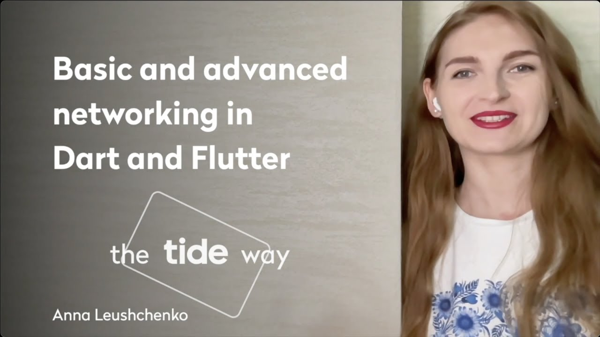

# Basic and advanced networking in Dart and Flutter — the Tide way

*Online talk at [the Flutter Global Summit 22](https://geekle.us/schedule/flutter2) on June 1, 2022.*

*Watch on [YouTube](https://youtu.be/EQZhIrevmTs).*

Tide is the leading provider of UK SME business accounts and one of the fastest-growing FinTechs in the UK. We are transforming the business banking market, providing a smart current account that gives time back to business owners.

At Tide, we develop mobile applications for Android and iOS using Flutter. In general, most applications, be it mobile, web, or desktop, depend on some kind of backend. Thus, an API layer is an integral part of application implementation. And Tide is no exception here.

This talk presents a compilation of tools and approaches developed to facilitate API layer implementation in Flutter and Dart applications we use at Tide.

Medium: https://link.medium.com/3eskgtlUlqb  
GitHub: https://github.com/foxanna/flutter_advanced_networking
