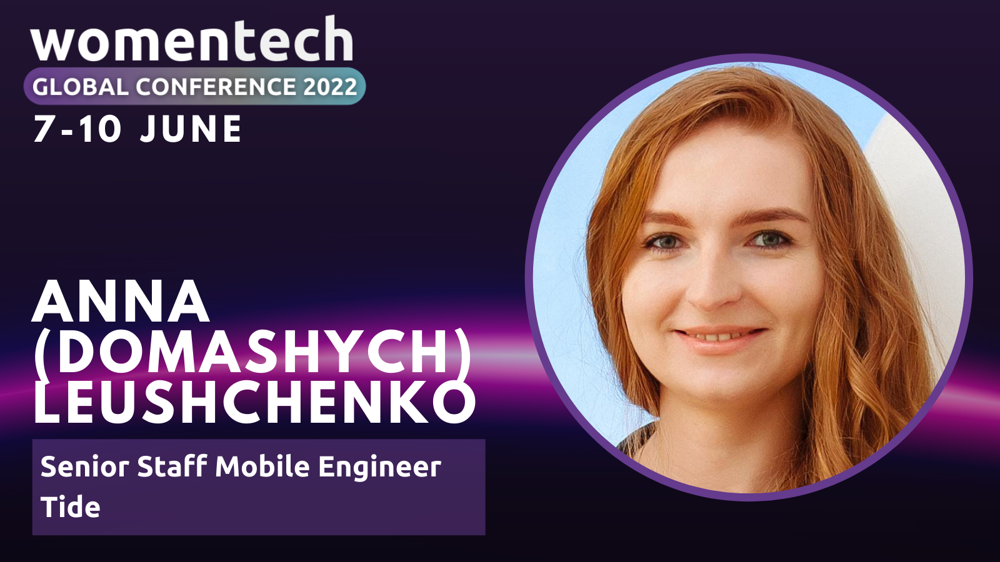

# Flutter: one framework to rule them all

*Online talk at [Women in Tech
Global Conference 2022](https://www.womentech.net/speaker/Anna/(Domashych)%20Leushchenko/69712) on June 8, 2022.*

*Watch on [YouTube](https://youtu.be/VCRIO0r64Xg).*

Since its first stable release in December 2018, Flutter concurred the hearts of thousands of software engineers. It brings a performant and beautiful user experience to all platforms possible: Android, iOS, web, Windows, macOS, Linux, and embedded devices. All from a single codebase.
We'll talk about how exactly it is possible, what is the Flutter developer experience, and how to try it yourself.
