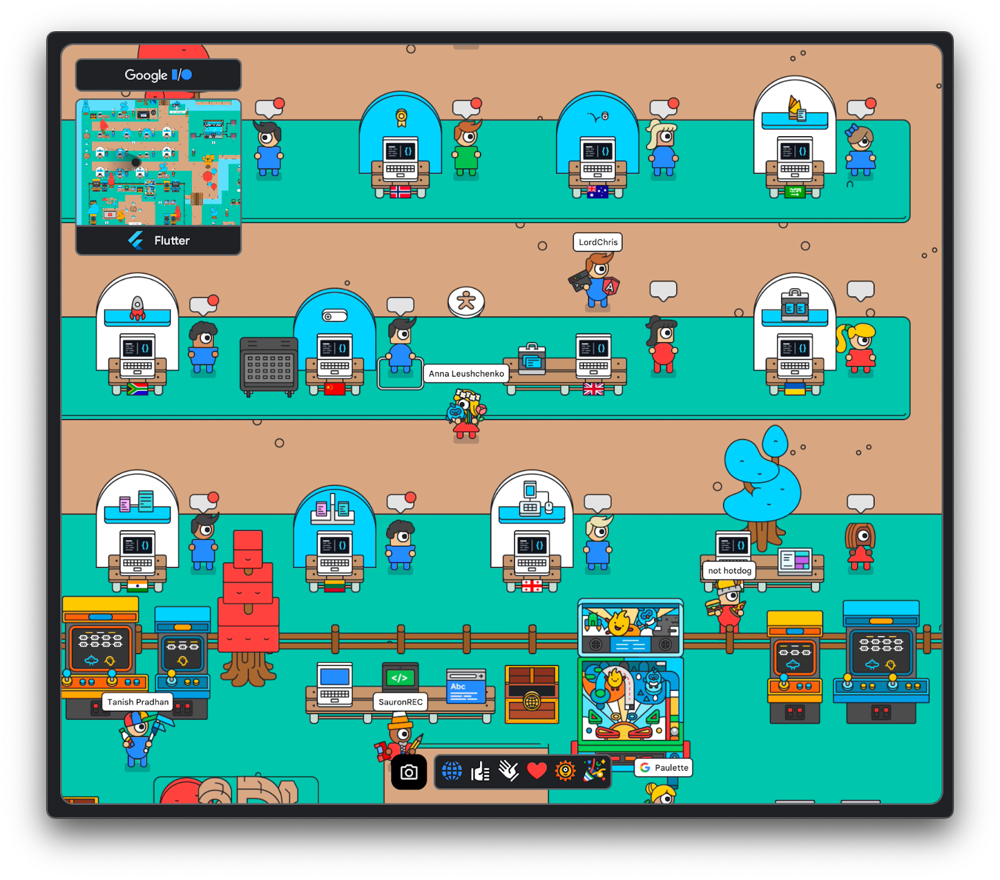

# DartPad воркшопи від Flutter GDE

Цього року, як і минулого разу, Google I/O проходив переважно онлайн, у віртуальному світі [Adventure world](https://adventure.withgoogle.com/io/). На віртуальних стендах була представлена велика кількість ознайомчих і навчальних матеріалів, які підготували співробітники Google, компанії, що користуються технологіями від Google, і комьюніті. Серед них у Flutter зоні були представлені пʼятнадцять DartPad воркшопів, створених Google Developer Expert-ами у Flutter з різних країн, в тому числі два з України.

Незважаючи на те, що Google I/O вже пройшов, всі матеріали доступні для ознайомлення на постійній основі. Далі надані посилання на кожен воркшоп із коротким описом, складеним самими авторами. Всі матеріали створено англійською мовою...

*[Опубліковано](https://dou.ua/forums/topic/38720/) на DOU у червні 2022.*

