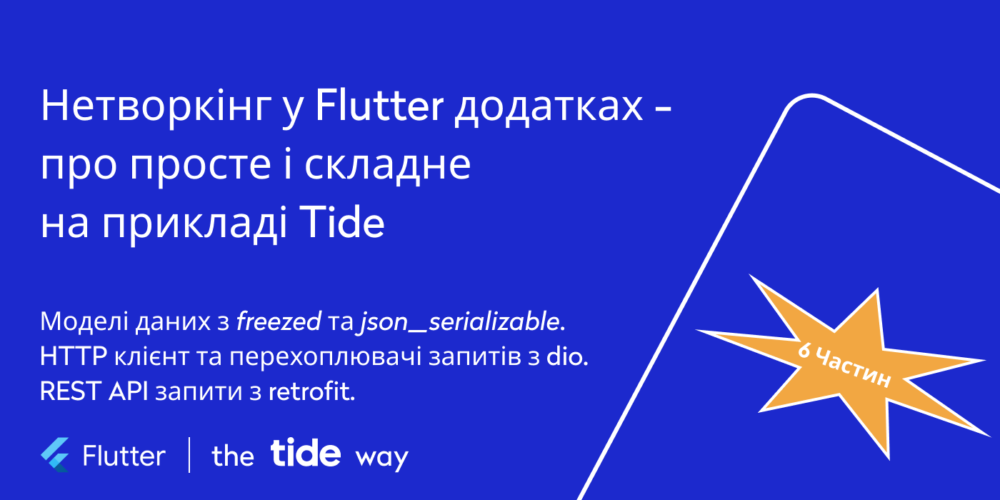

# Нетворкінг у Flutter додатках — про просте і складне на прикладі Tide

Більшість додатків, чи то мобільні, чи то веб, чи десктоп, залежать від того чи іншого бекенда. Отже, імплементація комунікації з API є невід’ємною частиною реалізації додатку. У цій серії з шести частин представлені інструменти та підходи, які полегшують розробку комунікації з API у Flutter додатках, які ми використовуємо в Tide.

Обіцяю, буде корисно і цікаво розробникам будь-якого рівня!

У цій серії поговоримо про:

* [Частина 0: Вступ](https://dou.ua/forums/topic/39051/)
* [Частина 1: моделі даних з freezed та json_serializable. Про просте](https://dou.ua/forums/topic/39092/)
* [Частина 2: моделі даних з freezed та json_serializable. Про складне](https://dou.ua/forums/topic/39153/)
* [Частина 3: HTTP клієнт та перехоплювачі запитів з dio. Про просте](https://dou.ua/forums/topic/39242/)
* [Частина 4: HTTP клієнт та перехоплювачі запитів з dio. Про складне](https://dou.ua/forums/topic/39286/)
* [Частина 5: REST API запити з retrofit. Про просте](https://dou.ua/forums/topic/39350/)
* [Частина 6: REST API запити з retrofit. Про складне](https://dou.ua/forums/topic/39396/)

