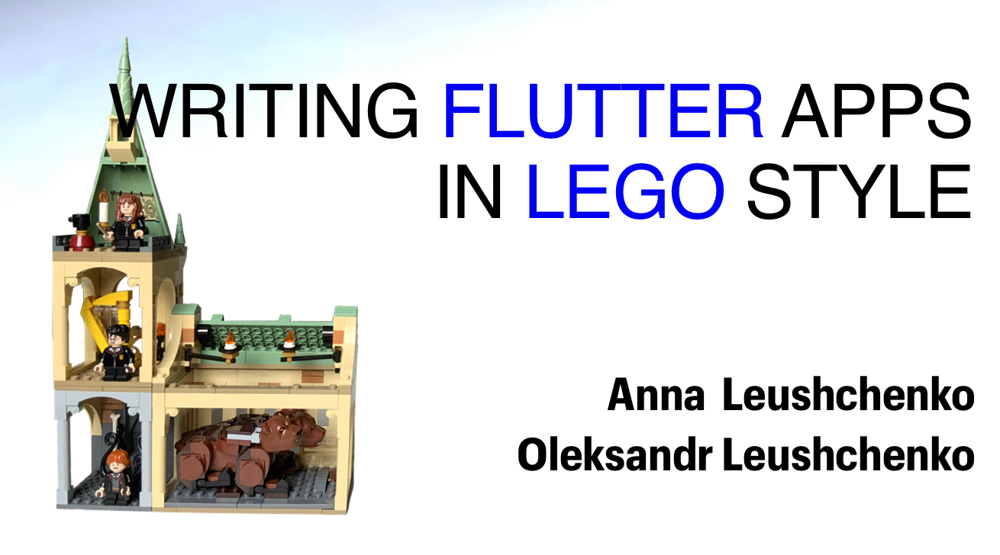

# Building Flutter apps in Lego style

*In-person talk by Anna and Oleksandr Leushchenko at the [Flutter Vikings conference](https://fluttervikings.com/) on August 31, 2022.*

*Watch on [YouTube](https://youtu.be/Ap-cRFRScQw).*

What’s the coolest thing about Lego? It’s the countless amount of combinations of little pieces that are put together through a primitive connection interface. This simplicity and versatility hold great power. Once you learn how to combine the bricks, you can unleash your creativity and build anything imaginable.

The same composition concept can be applied to building Flutter apps. Individual building blocks, containing UI, state management solution, business logic, dependency injection, navigation, localization, and configuration points, are put together through common interfaces just as Lego bricks. They can be easily plugged in and out and reused across products.

Join us to learn how to build Flutter apps in Lego style!

GitHub: https://github.com/olexale/lego_style_demo
