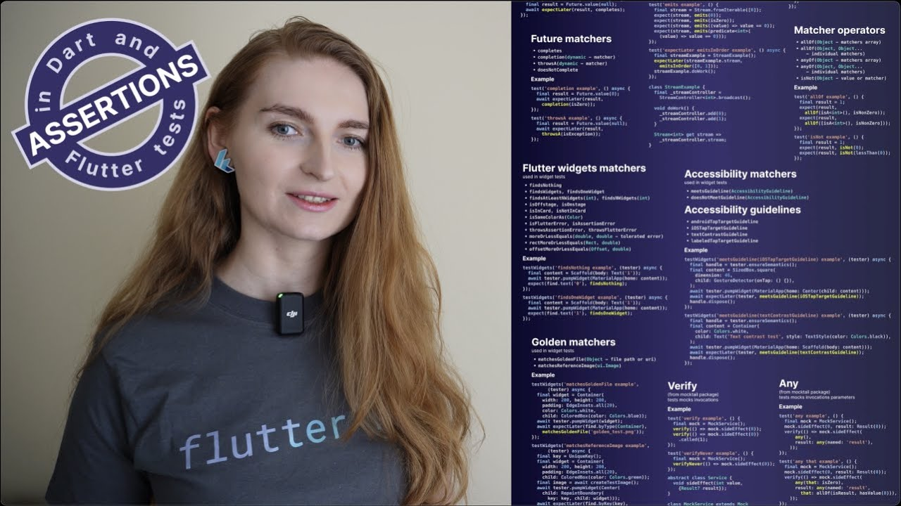

# Assertions in Dart and Flutter tests: an ultimate cheat sheet

*An online talk at the [Flutter Global Summit conference](https://geekle.us/schedule/flutter23?track=1637313230506x236187126462939140) on February 7, 2023.*

*Watch on [YouTube](https://youtu.be/heKTswfj2_E).*

GitHub: https://github.com/foxanna/tests_assertions_cheat_sheet

Tests are essential for ensuring any software quality. Whether you are creating unit, widget, or integration tests for Flutter applications, the end goal of any test is asserting that the reality matches the expectations. Here is an ultimate cheat sheet for assertions in Dart and Flutter tests with many details explained!
