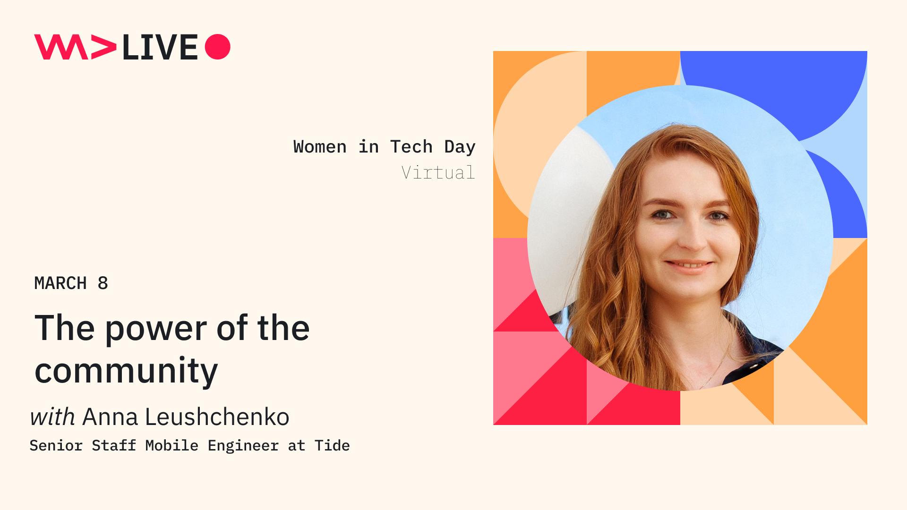

# The power of the community

*A live online talk at [Women in Tech Day by WeAreDevelopers LIVE](https://www.wearedevelopers.com/event/women-in-tech-day-march-2023) on March 8, 2023.*

*Watch on [YouTube](https://youtu.be/vxgqWgGpn5c).*

One of the powerful ways to speed up your journey to success is to emerge yourself in the right environment - community, which can influence your mindset, motivation, goals, and opportunities that life brings.I will share my story: how joining the right community changed my mindset and empowered me to reach the next professional level, from being a good software developer to becoming a frequent speaker at tech conferences, mentor, and role model for a younger generation of women in tech. I will talk about the power of communities, and how joining them can influence your career, and what other benefits it may bring. I will also provide useful links to female communities worth checking out.

