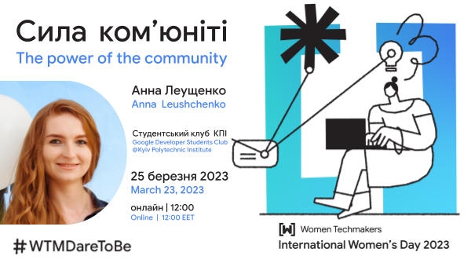

# Сила комʼюніті

*Онлайн виступ у [Google Developer Student Clubs у КПІ](https://gdsc.community.dev/events/details/developer-student-clubs-national-technical-university-of-ukraine-kyiv-polytechnic-institute-natsionalnii-tekhnichnii-universitet-ukrayini-kiyivskii-politekhnichnii-institut-presents-the-power-of-the-communitypage-to-stage/) 25 березня 2023.*

*Дивитись на [YouTube]().*

Один із потужних способів пришвидшити свій шлях до успіху – це зануритись у правильне середовище – комʼюніті, яке може вплинути на ваше мислення, мотивацію, цілі та можливості, які дає життя. Я поділюся своєю історією: як вступ до вдалого комʼюніті змінив моє мислення та допоміг мені досягти наступного професійного рівня: від сіньорної розробниці програмного забезпечення до спікерки на технічних конференціях, менторки і приклада для наслідування для молодшого покоління жінок в IT. Я розповім про силу комʼюніті, про те, як приєднання до них може вплинути на вашу кар’єру, та які ще переваги це може принести. Я також надам корисні посилання на жіночі комʼюніті, які варто переглянути.

[Дивитись слайди](WTM%20IWD%202023%20The%20power%20of%20the%20community%20by%20Anna%20Leushchenko.pdf).