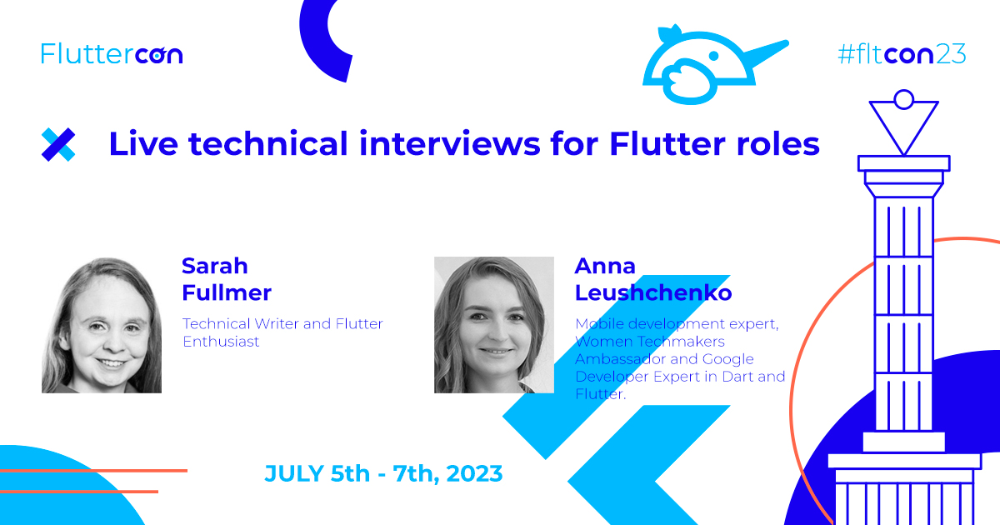

# Live technical interviews for Flutter roles

*An in-person talk at the [FlutterCon](https://fluttercon.dev/anna-leushchenko/) on July 6, 2023.*

Let’s get together for live interviews for Junior and Senior Flutter developer roles!

After a brief introduction, we jump into the heart of the talk: first, a Flutter expert will interview a fresh Flutter enthusiast for a Junior role; then, the roles reverse. Both parts will contain questions that touch on concepts likely to come up in real-life interviews, followed by a brief post-mortem. Additional Flutter interview resources are included.

After watching this talk, you will walk away with:
* An overview of key concepts:
  * for a Junior role interview
  * for a Senior role interview
* Interview best practices for interviewees and interviewers
* Confidence going into the interview process
