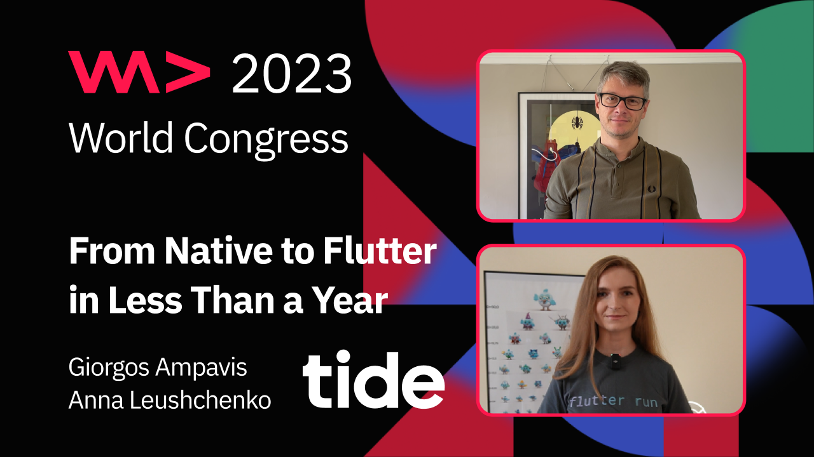

# From native to Flutter in less than a year

*A virtual talk at [WeAreDevelopers World Congress](https://www.wearedevelopers.com/world-congress) on July 27, 2023.*

*Watch on [YouTube](https://youtu.be/Wl8Pp9rjiAc).*

Tide is a financial services platform with a strong presence in the UK market and very ambitious global growth plans. We’ve been developing our mobile applications using native technologies for several years, and in pursuit of a solution with better performance, maintainability, and scalability, we chose to rebuild our product with Flutter, which is an emerging open-source framework by Google for building beautiful, natively compiled, multi-platform applications from a single codebase.

We are here to share our transformation journey: how we upskilled our native mobile engineers to Dart and Flutter, migrated our codebase to the new tech stack, and rolled out the new product to our users, ensuring the best possible transition. We will highlight the challenges we faced, the solutions we implemented, and the objectives we have achieved for our business and engineering team. We will also provide insights into the best practices and lessons learned during the process.
