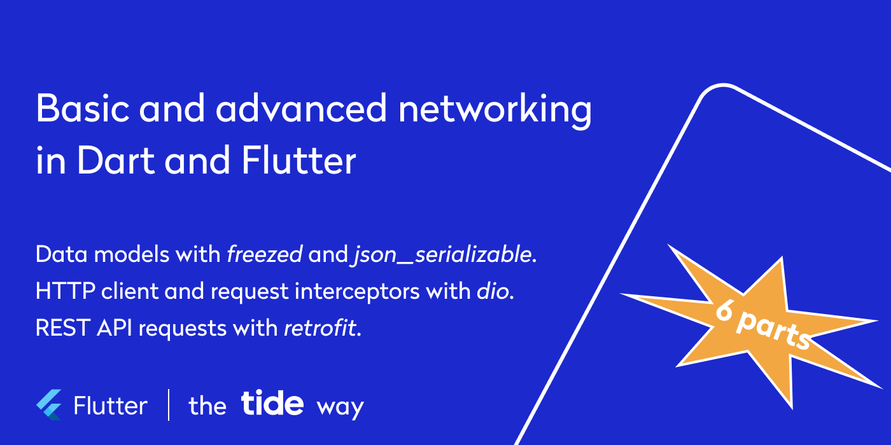

# Basic and advanced networking in Dart and Flutter

*A hands-on in-person workshop at [Flutter&Friends](https://www.flutterfriends.dev/schedule#schedule-item-50651) conference on September 5, 2023.*

Most applications, be it mobile, web, or desktop, depend on some kind of backend. Thus, an API layer is an integral part of application implementation.

I invite you to this hands-on workshop, where I will present tools and approaches that facilitate an effective API layer implementation in Flutter and Dart applications. We will apply this knowledge together to create a Flutter application that displays data obtained from hosted REST API.

You will walk away with knowledge about code generation in Dart and its application examples, and learn a few cool hacks on how to turn its principles to your advantage.
