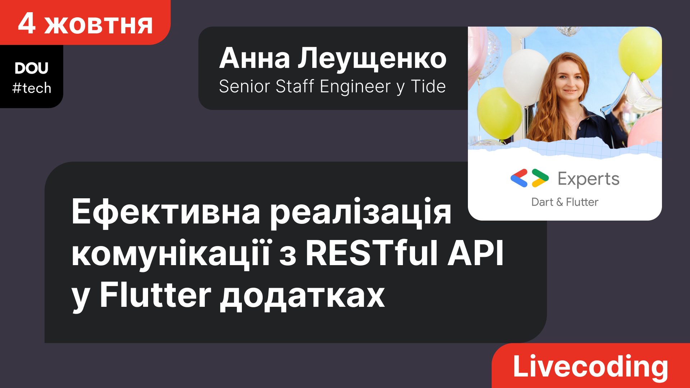

# Ефективна реалізація комунікації з RESTful API у Flutter додатках

*Двогодинний воркшоп [разом з DOU](https://dou.ua/calendar/48575/) 4 жовтня 2023.*

*Дивитись на [YouTube](https://www.youtube.com/watch?v=-2YHA7w7x_Q).*

Більшість додатків, не важливо, веб, мобільних, чи десктоп, у своїй роботі спираються на якийсь бекенд, найчастіше з RESTful API. Отже, імплементація комунікації з API є невід’ємною частиною реалізації додатка. В залежності від розміру проєкту, ця задача може потребувати значної кількості коду.

На цьому лайвкодінгу розберемо один із варіантів ефективної реалізації нетворкінгу у Flutter додатках із використанням кодогенерації та таких популярних пакетів, як freezed, json_serializable та retrofit. Навіть якщо ви вже активно використовуєте ці інструменти в роботі, але ще не знаєте, що freezed юніони теж можна автоматично парсити з JSON, або що retrofit запити можна обвішати кастомними аннотаціями, що впливатимуть на згенерений код - завітайте на цей воркшоп.

GitHub: https://github.com/foxanna/flutter_friends_networking_workshop
