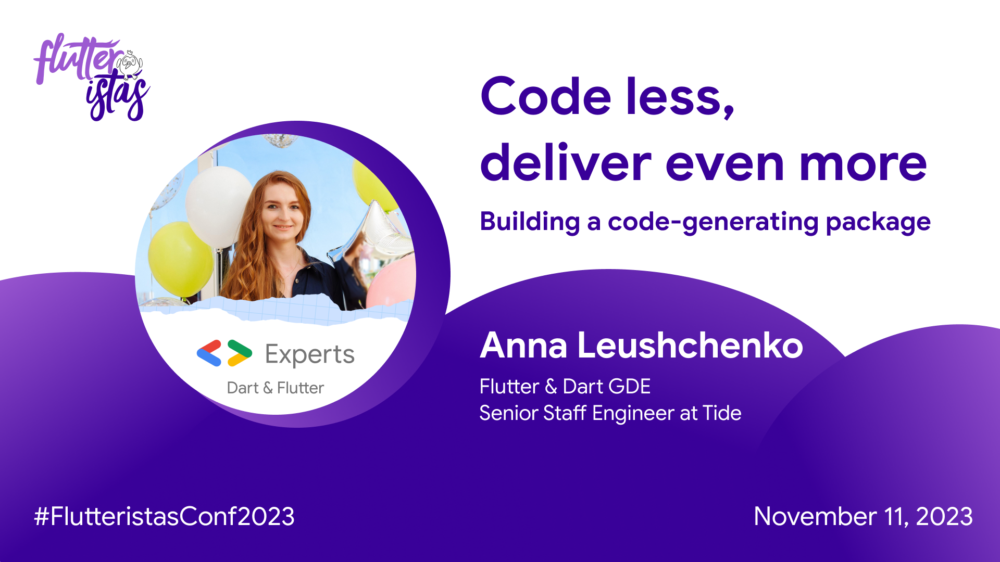

# Code less, deliver even more

*An online talk at [the Flutteristas Conference](https://flutteristas.org/flutteristas-conference) on November 11, 2023.*

*Watch on [YouTube](https://youtu.be/cg5PL2wvmKg).*

Over two years ago, at the first edition of the Flutteristas conference, Anna gave an insightful talk “Code less, deliver more” about using code-generating packages when solving typical tasks in mobile app development. 

This year Anna is back for the second edition of the Flutteristas conference to show how developers can create their own code-generating packages to automate even more daily routines, what typical challenges they may face, and where to look for inspiration on how to solve them.
