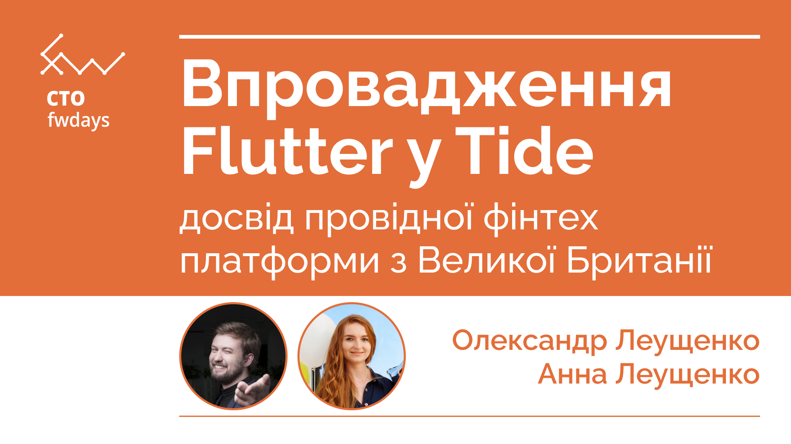

# Впровадження Flutter у Tide: досвід провідної фінтех платформи з Великої Британії

*Онлайн виступ на [CTO fwdays](https://fwdays.com/en/event/cto-fwdays-2023/review/bringing-flutter-in-the-world-of-finances) конференції 19 жовтня 2023.*

*Дивитись на [YouTube]().*

Tide - популярна у Великій Британії платформа фінансових послуг з амбіційними планами глобального росту. Протягом кількох років ми розробляли мобільні додатки використовуючи native технології. Стикнувшись із проблемами масштабування для виходу на нові ринки, неоднорідністю функціоналу між платформами, та обмеженнями поточного рішення, ми вирішили перебудувати наш продукт з Flutter. Flutter - це відносно молодий фреймворк від Google для створення кросплатформених додатків зі спільною кодовою базою.

У цій доповіді ми поділимось досвідом фундаментального перетворення продукту менше ніж за рік. Ми розповімо, як перевели iOS та Android розробників на Dart та Flutter, переписали більше мільйона рядків коду на новий технологічний стек та випустили нову версію продукту для сотень тисяч користувачів. Ми висвітлимо виклики, з якими зіткнулися, рішення, які впровадили, та уроки, яких нас навчила ця трансформація.
