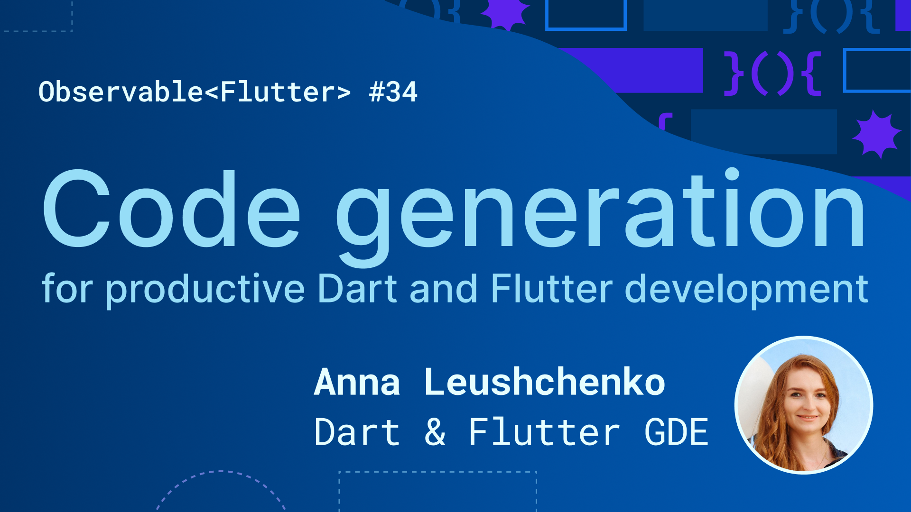

# "Code generation for productive Dart and Flutter development" at Observable<Flutter>

*A [guest podcast at Observable<Flutter> show](https://www.youtube.com/watch?v=jYWOyMZamcY) on the official Flutter team YouTube channel on February 1, 2024*

I joined the Observable Flutter stream with Craig Labenz to talk about "Code generation for productive Dart and Flutter development".
We had a very practical live-coding session where I showcased the usage of `json_serializable`, `freezed`, `retrofit`, `injectable`, and `barrel_files` packages in a single Flutter project, which allowed me to remove a ton of the code that I had previously written manually.

I also shared multiple practical tips and tricks based on my experience of how to set up the codebase maintenance in the most efficient way.
