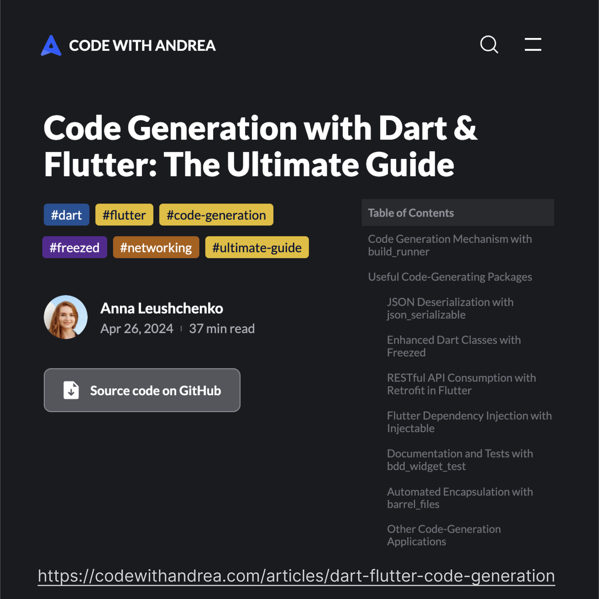

# Code Generation with Dart and Flutter: The Ultimate Guide

*An article on pushing Dart and Flutter development experience productivity further by adopting techniques like code generation, from April 26, 2024.*

*Read at [Code with Andrea](https://codewithandrea.com/articles/dart-flutter-code-generation/).*

This guide covers all aspects of integrating code generation in day-to-day development, including:
* Code generation mechanism: we’ll discuss how the code generation mechanism with build_runner works.
* Useful code-generating packages: we’ll look into useful packages such as json_serializable, freezed, retrofit, injectable, bdd_widget_test, barrel_files, and learn how they simplify typical Flutter apps development tasks.
* Efficient codebase maintenance: you’ll get practical advice on efficiently maintaining projects that extensively use code generation. This section will teach you how to: optimize the code generator input, configure static analysis, simplify generation launching, create code snippets, collapse generated files in IDE, update code coverage reports, and control code generation order. We’ll also discuss how practices like keeping packages small, adding generated files to Git, locking dependencies versions, and reusing configured annotations can improve code-generation performance and enhance the developers’ experience.
